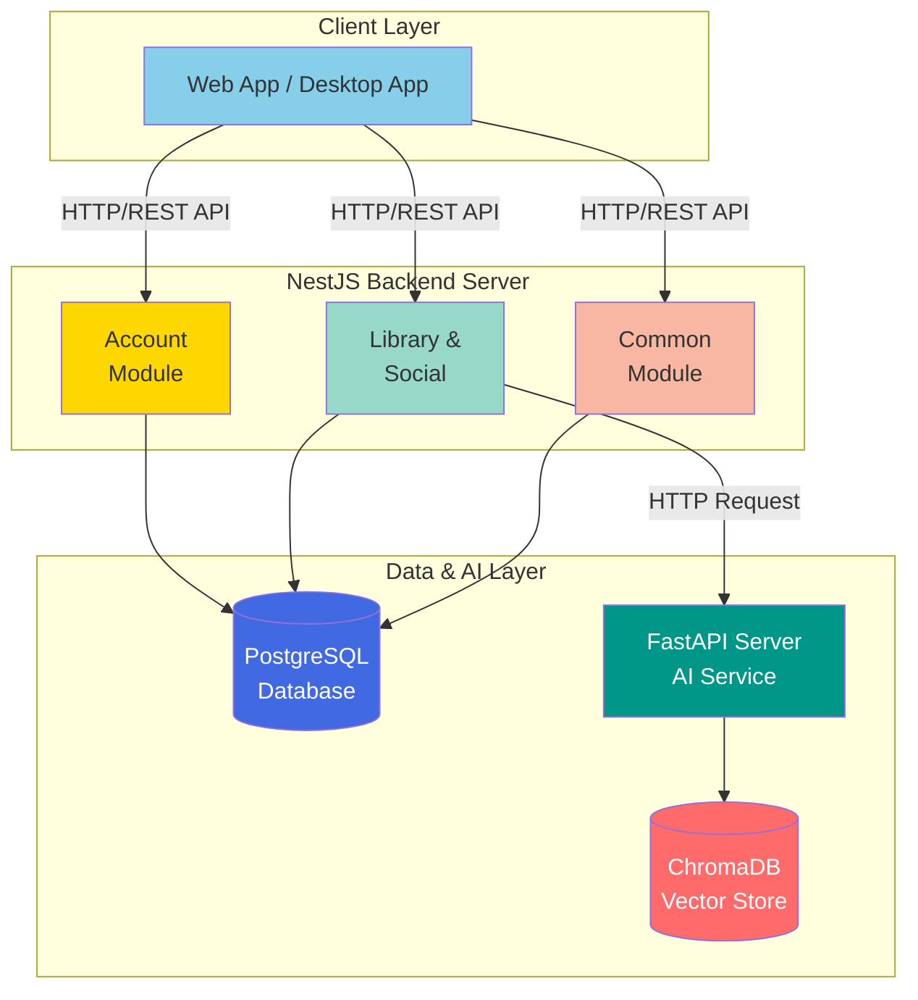

# NewLearnNote Backend

> RAG 파이프라인 기반 AI 문서 학습 플랫폼

[](https://nestjs.com/)
[](https://fastapi.tiangolo.com/)
[](https://www.postgresql.org/)
[](https://www.typescriptlang.org/)
[](https://www.python.org/)

## Overview

NewLearnNote는 기록(Obsidian, Notion 등), 지식 탐색(AI), 공유 및 참고(Blog) 간의 잦은 서비스 전환으로 인한 집중력 저하 및 학습 흐름 단절 문제를 해결하기 위해 개발된 플랫폼입니다.

하나의 플랫폼에서 문서 업로드, AI 기반 질의응답, 타 사용자와의 지식 공유가 가능하며, **RAG(Retrieval-Augmented Generation)** 기반으로 업로드된 문서의 컨텍스트를 이해하고 정확한 답변을 제공합니다.

**NestJS** 백엔드와 **FastAPI** AI 서버로 구성된 서비스 아키텍처를 채택하여 비즈니스 로직과 AI 처리를 분리하고 각 서비스의 독립적인 확장성을 확보했습니다.
- [NestJS API Server code](./api/README.md)
- [FastAPI AI Server code](./ai/README.md)

## Key Features

### AI Document Analysis
- **문서 파싱 및 청킹**: FastAPI Background Tasks를 활용한 비동기 문서 처리 파이프라인으로 PDF/Markdown/Text 파일에서 텍스트 추출 후 LangChain RecursiveCharacterTextSplitter로 최적 청킹(chunk_size: 1000, overlap: 200) 수행
- **벡터 검색**: OpenAI text-embedding-3-small 모델로 임베딩 생성 후 ChromaDB에 저장하여 코사인 유사도 기반 Top-K 검색 구현
- **컨텍스트 기반 질의응답**: 검색된 문서 청크를 컨텍스트로 제공하여 OpenAI GPT-4o-mini 모델이 정확한 답변을 생성하는 RAG(Retrieval-Augmented Generation) 파이프라인 구축

### Note & Library Management
- **Private/Published 브랜치 관리**: GCS 폴더 구조를 활용하여 작성 중인 문서(Private)와 공개된 문서(Published)를 분리 관리하며, LibraryOwnerGuard로 Private 파일 접근 권한 검증
- **파일 트리 및 Signed URL**: GCS API로 실시간 파일 트리를 조회하고, 파일 접근 시 시간 제한 Signed URL을 생성하여 보안과 정적 파일 서빙 성능 최적화
- **노트 네트워크**: NoteNetwork 테이블로 노트 간 참조 관계를 Self-Join 구조로 모델링하여 연관 노트 추적 기능 구현 (linked/embed 타입 지원)

### Authentication & Authorization
- **멀티 플랫폼 인증 분리**: Google OAuth 2.0 기반 소셜 로그인을 웹(Cookie 기반)과 데스크톱(Header 기반)으로 분리 구현하여 각 플랫폼의 보안 요구사항 충족
- **토큰 관리 및 보안**: JWT Access Token과 Refresh Token을 발급하고, 토큰 갱신 시 기존 토큰을 PostgreSQL 블랙리스트에 등록하여 재사용 방지 및 즉시 무효화 구현
- **데스크톱 앱 연동**: OAuth 콜백 후 Deep Link(newlearnnote://)로 토큰을 안전하게 데스크톱 앱에 전달하여 크로스 플랫폼 인증 흐름 구현

### Google Cloud
- **Cloud Run 서버리스 배포**: Docker 기반의 NestJS 및 FastAPI 서버를 클라우드 네이티브 환경에 배포하여 인프라 관리 효율을 높이고, 트래픽에 따른 자동 확장(Auto-scaling) 환경 구축
- **GCS Signed URL 전략**: 문서 파일에 대한 시간 제한 접근 URL을 동적 생성하여 보안 접근 권한 관리 및 효율적인 파일 정적 서빙 파이프라인 구현

## Tech Stack

### Backend (NestJS)
| Category | Technology |
|----------|------------|
| **Framework** | NestJS (Node.js + TypeScript) |
| **Database** | PostgreSQL 14 + TypeORM |
| **Authentication** | Passport.js (Google OAuth 2.0) + JWT |
| **Storage** | Google Cloud Storage |
| **API Documentation** | Swagger (OpenAPI 3.0) |

### AI Server (FastAPI)
| Category | Technology |
|----------|------------|
| **Framework** | FastAPI (Python 3.11) |
| **LLM** | OpenAI GPT-4o-mini |
| **Vector Database** | ChromaDB |
| **AI Framework** | LangChain |
| **Document Processing** | PyPDF2, python-docx, langchain-text-splitters |
| **Task Queue** | FastAPI Background Tasks |

### Infrastructure
- **Cloud**: Google Cloud Platform (GCS)
- **Deployment**: Docker
- **Monitoring**: Custom metrics endpoint

## System Architecture



### Architecture Highlights
- **마이크로서비스 분리**: 비즈니스 로직(NestJS)과 AI 처리(FastAPI)를 독립적으로 운영
- **비동기 처리**: FastAPI Background Tasks로 문서 처리 시간 최적화
- **벡터 검색**: ChromaDB로 임베딩 저장 및 코사인 유사도 기반 검색
- **확장 가능한 DB 설계**: PostgreSQL로 그래프 구조 모델링 (Self-Join)

## Documentation

프로젝트의 상세한 설계 및 구현 내용은 아래 순서로 읽는 것을 권장합니다:

**1. 시스템 아키텍처**
- **[System Architecture](./docs/ARCHITECTURE.md)** - 전체 시스템 개요 및 기술 스택 선택 이유

**2. 데이터 구조**
- **[Database Architecture](./docs/DATABASE.md)** - PostgreSQL 스키마, ChromaDB 벡터 스토어, ERD

**3. 핵심 기능**
- **[Authentication & Authorization](./docs/AUTH_FLOW.md)** - Google OAuth 2.0, JWT, 멀티 플랫폼 인증
- **[File Storage Strategy](./docs/FILE_STORAGE.md)** - GCS 파일 관리, Signed URL, 라이브러리 파일 트리
- **[Async Processing](./docs/ASYNC_PROCESSING.md)** - FastAPI Background Tasks, 비동기 문서 처리
- **[RAG Pipeline](./docs/RAG_PIPELINE.md)** - 문서 파싱, 임베딩, 벡터 검색, AI 응답 생성

**4. 운영 및 보안**
- **[Security Architecture](./docs/SECURITY.md)** - 인증/인가, 데이터 암호화, API 보안
- **[Performance Optimization](./docs/PERFORMANCE.md)** - Rate Limiting, 캐싱, 벡터 검색 최적화
- **[Cloud Infrastructure](./docs/INFRASTRUCTURE.md)** - Cloud Run 배포, Docker 컨테이너화

## Project Structure

```
server-demo/
├── api/                      # NestJS Backend
│   ├── src/
│   │   ├── account/          # 사용자 계정 및 인증
│   │   │   ├── auth/         # Google OAuth, JWT 인증
│   │   │   └── user/         # 사용자 정보 관리
│   │   ├── library/          # 라이브러리 관리
│   │   │   └── dto/          # Library DTO
│   │   ├── social/           # 노트 및 소셜 기능
│   │   │   ├── note/         # 노트 CRUD
│   │   │   ├── note-bookmark/  # 북마크
│   │   │   ├── note-network/ # 노트 간 연결 그래프
│   │   │   ├── note-tag/     # 노트-태그 연결
│   │   │   └── tag/          # 태그 관리
│   │   ├── common/           # 공통 모듈
│   │   │   ├── guards/       # Rate limiting, Auth guards
│   │   │   ├── filters/      # Global exception filters
│   │   │   └── module/       # Storage, File 등
│   │   ├── billing/          # 결제 관리
│   │   ├── admin/            # 관리자 기능
│   │   └── main.ts           # Application entry point
│   └── prisma/               # Prisma ORM
│       └── schema/           # Database schema
├── ai/                       # FastAPI AI 서비스
│   ├── app/
│   │   ├── routers/          # API 라우터
│   │   ├── services/         # AI 처리 로직 (RAG, Document)
│   │   ├── models/           # SQLAlchemy 모델
│   │   └── main.py           # FastAPI entry point
│   └── chroma/               # ChromaDB 벡터 저장소
├── docs/                     # 프로젝트 문서
└── README.md
```