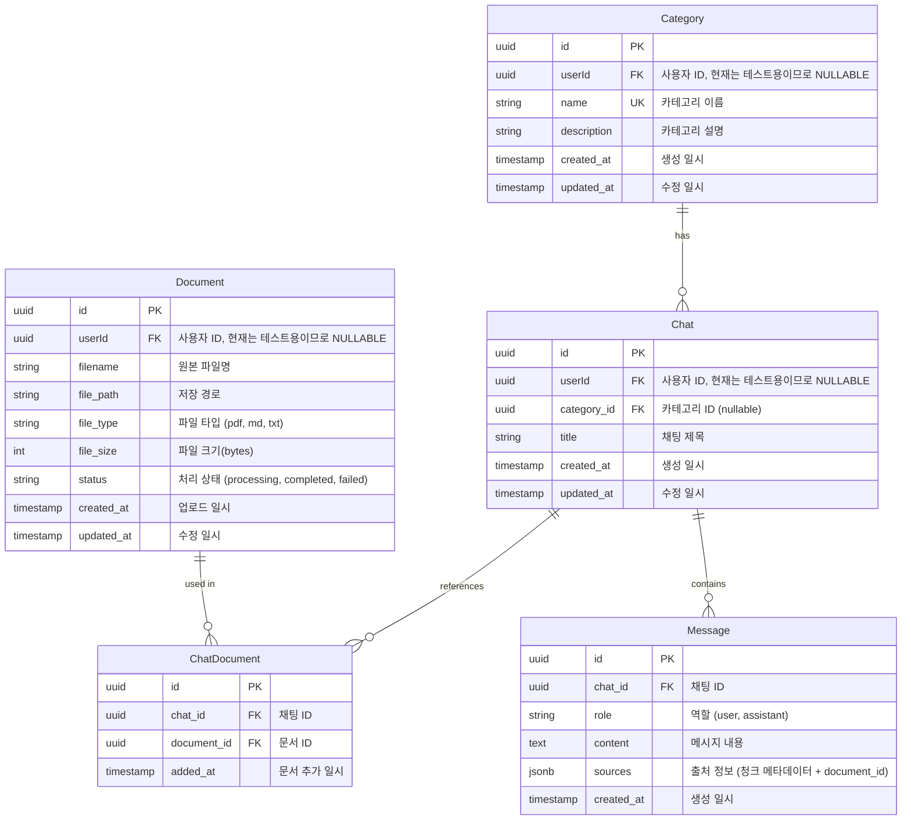

```mermaid
erDiagram
    Category ||--o{ Chat : "has"
    Chat ||--o{ ChatDocument : "references"
    Document ||--o{ ChatDocument : "used in"
    Chat ||--o{ Message : "contains"

    Category {
        uuid id PK
        uuid userId FK "사용자 ID, 현재는 테스트용이므로 NULLABLE"
        string name UK "카테고리 이름"
        string description "카테고리 설명"
        timestamp created_at "생성 일시"
        timestamp updated_at "수정 일시"
    }

    Chat {
        uuid id PK
        uuid userId FK "사용자 ID, 현재는 테스트용이므로 NULLABLE"
        uuid category_id FK "카테고리 ID (nullable)"
        string title "채팅 제목"
        timestamp created_at "생성 일시"
        timestamp updated_at "수정 일시"
    }

    Document {
        uuid id PK
        uuid userId FK "사용자 ID, 현재는 테스트용이므로 NULLABLE"
        string filename "원본 파일명"
        string file_path "저장 경로"
        string file_type "파일 타입 (pdf, md, txt)"  
        int file_size "파일 크기(bytes)"
        string status "처리 상태 (processing, completed, failed)"
        timestamp created_at "업로드 일시"
        timestamp updated_at "수정 일시"
    }

    ChatDocument {
        uuid id PK
        uuid chat_id FK "채팅 ID"
        uuid document_id FK "문서 ID"
        timestamp added_at "문서 추가 일시"
    }

    Message {
        uuid id PK
        uuid chat_id FK "채팅 ID"
        string role "역할 (user, assistant)"
        text content "메시지 내용"
        jsonb sources "출처 정보 (청크 메타데이터 + document_id)"
        timestamp created_at "생성 일시"
    }
```