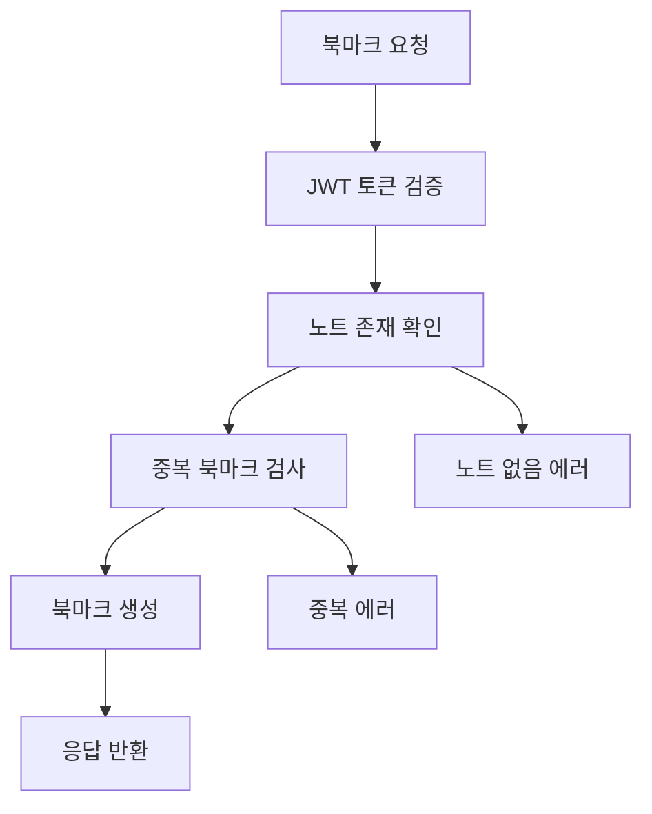

# Note Bookmark System Documentation

## 📌 시스템 개요

노트 북마크 시스템은 사용자가 관심 있는 노트를 저장하고 관리할 수 있는 기능을 제공합니다. 사용자는 마음에 드는 노트를 북마크에 추가하여 나중에 빠르게 접근할 수 있습니다.

### 🎯 주요 기능

- **북마크 추가/제거**: 노트를 개인 북마크 목록에 추가하거나 삭제
- **북마크 목록 관리**: 저장된 북마크들을 시간순으로 조회
- **북마크 상태 확인**: 특정 노트의 북마크 여부 실시간 확인
- **중복 방지**: 동일한 노트의 중복 북마크 자동 차단

---

## 🏗️ 시스템 아키텍처

### 📁 디렉토리 구조

```
src/social/note-bookmark/
├── dto/
│   └── note-bookmark.dto.ts          # 데이터 전송 객체
├── note-bookmark.controller.ts       # API 엔드포인트 컨트롤러
├── note-bookmark.service.ts          # 비즈니스 로직 처리
├── note-bookmark.repository.ts       # 데이터베이스 접근 레이어
└── note-bookmark.module.ts          # NestJS 모듈 설정
```

### 🔄 레이어드 아키텍처

#### **1. Controller Layer** (`note-bookmark.controller.ts`)

- **역할**: HTTP 요청/응답 처리, API 라우팅
- **책임**:
  - 요청 데이터 검증
  - JWT 인증 처리
  - Swagger 문서화
  - 응답 형태 표준화

#### **2. Service Layer** (`note-bookmark.service.ts`)

- **역할**: 비즈니스 로직 처리
- **책임**:
  - 북마크 생성/삭제 규칙 검증
  - 중복 북마크 방지
  - 권한 확인
  - 데이터 변환 및 포맷팅

#### **3. Repository Layer** (`note-bookmark.repository.ts`)

- **역할**: 데이터베이스 접근 및 쿼리 처리
- **책임**:
  - Prisma ORM을 통한 DB 연산
  - 복잡한 조인 쿼리 처리
  - 트랜잭션 관리
  - 성능 최적화된 쿼리 제공

---

## 💾 데이터베이스 설계

### NoteBookmark 테이블 구조

```sql
CREATE TABLE note_bookmark (
    id         VARCHAR(255) PRIMARY KEY,     -- ULID 기반 고유 ID
    note_id    VARCHAR(255) NOT NULL,       -- 북마크할 노트 ID
    user_id    VARCHAR(255) NOT NULL,       -- 북마크한 사용자 ID
    created_at TIMESTAMP(6) DEFAULT NOW(),  -- 북마크 생성 시간

    -- 외래키 제약조건
    CONSTRAINT fk_bookmark_note FOREIGN KEY (note_id) REFERENCES note(id),
    CONSTRAINT fk_bookmark_user FOREIGN KEY (user_id) REFERENCES user(id),

    -- 중복 방지를 위한 복합 유니크 인덱스
    CONSTRAINT uq_user_note UNIQUE (note_id, user_id)
);
```

### 관계 정의

```typescript
// Prisma Schema 관계
model NoteBookmark {
    id        String   @id @default(ulid())
    noteId    String
    userId    String
    createdAt DateTime @default(now())

    // 관계 정의
    note      Note     @relation(fields: [noteId], references: [id])
    user      User     @relation(fields: [userId], references: [id])

    @@unique([noteId, userId])  // 복합 유니크 제약
    @@map("note_bookmark")
}
```

---

## ⚙️ 핵심 기능 구현

### 🔐 인증 및 보안

- **JWT 기반 인증**: 모든 API에 `JwtAuthGuard` 적용
- **사용자 격리**: 각 사용자는 자신의 북마크만 접근 가능
- **권한 검증**: Repository에서 사용자별 데이터 필터링

### 🚫 중복 방지 메커니즘

```typescript
// 1. 데이터베이스 레벨 (복합 유니크 제약)
@@unique([noteId, userId])

// 2. 애플리케이션 레벨 (Service 계층)
async preventDuplicateBookmark(userId: string, noteId: string) {
    const exists = await this.repository.exists(userId, noteId);
    if (exists) {
        throw new ConflictException('이미 북마크한 노트입니다.');
    }
}
```

### 📊 성능 최적화

- **선택적 데이터 로딩**: 필요한 필드만 SELECT
- **인덱스 활용**: userId, noteId 조합에 복합 인덱스
- **N+1 쿼리 방지**: Prisma include를 통한 조인 쿼리

---

## 🔧 비즈니스 로직

### 북마크 생성 플로우



### 데이터 검증 규칙

1. **노트 존재성**: 북마크하려는 노트가 실제로 존재하는지 확인
2. **삭제된 노트 확인**: `deletedAt` 필드로 삭제된 노트는 북마크 불가
3. **중복 방지**: 동일한 사용자-노트 조합의 북마크 차단
4. **권한 검증**: 본인의 북마크만 조회/삭제 가능

---

## 🛠️ 기술 스택

### Backend Framework

- **NestJS**: TypeScript 기반 서버 프레임워크
- **Prisma ORM**: 타입 안전한 데이터베이스 ORM
- **PostgreSQL**: 관계형 데이터베이스

### 개발 도구

- **Swagger**: API 문서 자동 생성
- **Class Validator**: DTO 유효성 검사
- **JWT**: 인증 토큰 관리

---

## API 엔드포인트

### 1. 북마크 생성

#### `POST /bookmarks`

**설명**: 특정 노트를 북마크에 추가합니다.

**Headers**:

```
Authorization: Bearer {jwt_token}
Content-Type: application/json
```

**Request Body**:

```json
{
  "noteId": "01HZXK123ABCDEF456GHI789JK"
}
```

**Response** (201 Created):

```json
{
  "id": "01HZXK999BOOKMARK123456789",
  "userId": "01HZXK111USER123456789ABC",
  "noteId": "01HZXK123ABCDEF456GHI789JK",
  "note": {
    "id": "01HZXK123ABCDEF456GHI789JK",
    "title": "TypeScript 고급 기법",
    "userId": "01HZXK222AUTHOR123456789DEF",
    "user": {
      "nickname": "개발자김씨",
      "avatarUrl": "https://example.com/avatar.jpg"
    }
  },
  "createdAt": "2024-11-14T10:30:00.000Z"
}
```

**Error Responses**:

- `400 Bad Request`: 이미 북마크한 노트
- `404 Not Found`: 존재하지 않는 노트
- `401 Unauthorized`: 인증 토큰 없음

---

### 2. 북마크 목록 조회

#### `GET /bookmarks`

**설명**: 현재 사용자의 모든 북마크 목록을 조회합니다.

**Headers**:

```
Authorization: Bearer {jwt_token}
```

**Response** (200 OK):

```json
{
  "bookmarks": [
    {
      "id": "01HZXK999BOOKMARK123456789",
      "userId": "01HZXK111USER123456789ABC",
      "noteId": "01HZXK123ABCDEF456GHI789JK",
      "note": {
        "id": "01HZXK123ABCDEF456GHI789JK",
        "title": "TypeScript 고급 기법",
        "userId": "01HZXK222AUTHOR123456789DEF",
        "user": {
          "nickname": "개발자김씨",
          "avatarUrl": "https://example.com/avatar.jpg"
        }
      },
      "createdAt": "2024-11-14T10:30:00.000Z"
    },
    {
      "id": "01HZXK888BOOKMARK987654321",
      "userId": "01HZXK111USER123456789ABC",
      "noteId": "01HZXK456DEF789ABC123GHI456",
      "note": {
        "id": "01HZXK456DEF789ABC123GHI456",
        "title": "React Hooks 완전정복",
        "userId": "01HZXK333AUTHOR456789ABC123",
        "user": {
          "nickname": "프론트엔드박씨",
          "avatarUrl": "https://example.com/avatar2.jpg"
        }
      },
      "createdAt": "2024-11-13T15:20:00.000Z"
    }
  ],
  "totalCount": 2,
  "page": 1,
  "limit": 2
}
```

---

### 3. 북마크 삭제

#### `DELETE /bookmarks/{noteId}`

**설명**: 특정 노트의 북마크를 삭제합니다.

**Headers**:

```
Authorization: Bearer {jwt_token}
```

**Path Parameters**:

- `noteId`: 삭제할 북마크의 노트 ID

**Response** (200 OK):

```json
{
  "message": "북마크가 삭제되었습니다."
}
```

**Error Responses**:

- `404 Not Found`: 북마크를 찾을 수 없음
- `401 Unauthorized`: 인증 토큰 없음

---

### 4. 북마크 여부 확인

#### `GET /bookmarks/check/{noteId}`

**설명**: 특정 노트가 현재 사용자의 북마크에 있는지 확인합니다.

**Headers**:

```
Authorization: Bearer {jwt_token}
```

**Path Parameters**:

- `noteId`: 확인할 노트 ID

**Response** (200 OK):

```json
{
  "isBookmarked": true
}
```

---

## 데이터 모델

### CreateBookmarkDto

```typescript
{
  noteId: string; // 북마크할 노트 ID (필수)
}
```

### BookmarkResponseDto

```typescript
{
  id: string;           // 북마크 ID
  userId: string;       // 사용자 ID
  noteId: string;       // 노트 ID
  note: {               // 노트 정보
    id: string;
    title: string;
    userId: string;
    user: {
      nickname: string;
      avatarUrl?: string;
    };
  };
  createdAt: Date;      // 북마크 생성일시
}
```

### BookmarkListResponseDto

```typescript
{
  bookmarks: BookmarkResponseDto[];  // 북마크 배열
  totalCount: number;                // 전체 북마크 수
  page: number;                      // 현재 페이지
  limit: number;                     // 페이지당 개수
}
```

---

## 사용 예시

### 1. 노트 북마크하기

```bash
curl -X POST "http://localhost:8000/api/bookmarks" \
  -H "Authorization: Bearer your_jwt_token" \
  -H "Content-Type: application/json" \
  -d '{"noteId": "01HZXK123ABCDEF456GHI789JK"}'
```

### 2. 북마크 목록 보기

```bash
curl -X GET "http://localhost:8000/api/bookmarks" \
  -H "Authorization: Bearer your_jwt_token"
```

### 3. 북마크 삭제하기

```bash
curl -X DELETE "http://localhost:8000/api/bookmarks/01HZXK123ABCDEF456GHI789JK" \
  -H "Authorization: Bearer your_jwt_token"
```

### 4. 북마크 여부 확인하기

```bash
curl -X GET "http://localhost:8000/api/bookmarks/check/01HZXK123ABCDEF456GHI789JK" \
  -H "Authorization: Bearer your_jwt_token"
```

---

## 비즈니스 규칙

1. **중복 방지**: 같은 노트를 중복으로 북마크할 수 없습니다.
2. **소유권**: 본인의 북마크만 삭제할 수 있습니다.
3. **삭제된 노트**: 삭제된 노트는 북마크할 수 없습니다.
4. **인증 필수**: 모든 API는 JWT 인증이 필요합니다.

---

## 💻 구현 세부사항

### Repository 패턴 적용

```typescript
// Repository Layer - 데이터 접근 전용
class NoteBookmarkRepository {
  // 기본 CRUD 작업
  async create(userId: string, noteId: string);
  async findById(id: string);
  async findByUserAndNote(userId: string, noteId: string);
  async exists(userId: string, noteId: string);

  // 복잡한 쿼리
  async findManyByUser(userId: string);
  async getCountByUser(userId: string);

  // 트랜잭션 처리
  async createWithTransaction(data);
  async deleteWithTransaction(id, noteId);
}
```

### 에러 처리 전략

```typescript
// 구체적인 에러 타입별 처리
try {
  await this.service.create(userId, dto);
} catch (error) {
  if (error instanceof ConflictException) {
    // 409 Conflict - 중복 북마크
  } else if (error instanceof NotFoundException) {
    // 404 Not Found - 노트/북마크 없음
  } else if (error instanceof ForbiddenException) {
    // 403 Forbidden - 권한 없음
  }
}
```

### 타입 안전성

```typescript
// Prisma 타입을 확장한 커스텀 타입
export type NoteBookmarkWithNote = NoteBookmark & {
  note: {
    id: string;
    title: string;
    userId: string;
    user: {
      nickname: string;
      avatarUrl?: string;
    };
  };
};
```

---

## 🔄 확장 가능성

### 추가 예정 기능

1. **북마크 폴더**: 북마크를 카테고리별로 분류
2. **북마크 메모**: 각 북마크에 개인적인 메모 추가
3. **북마크 공유**: 다른 사용자와 북마크 목록 공유
4. **북마크 통계**: 사용자별/노트별 북마크 통계
5. **북마크 검색**: 북마크한 노트 내용 검색

### 성능 개선 계획

1. **캐싱 도입**: Redis를 통한 자주 조회되는 북마크 캐싱
2. **페이지네이션**: 대용량 북마크 목록 처리
3. **인덱스 최적화**: 쿼리 성능 향상을 위한 DB 인덱스 추가

### 모니터링

1. **로깅**: 북마크 생성/삭제 활동 로그
2. **메트릭**: 북마크 사용 통계 수집
3. **알림**: 인기 노트 북마크 알림 기능

---

## 🧪 테스트 전략

### Unit Test

- Service 레이어 비즈니스 로직 테스트
- Repository 레이어 데이터 접근 테스트
- DTO 유효성 검사 테스트

### Integration Test

- Controller와 Service 통합 테스트
- 데이터베이스 트랜잭션 테스트
- JWT 인증 플로우 테스트

### E2E Test

- 전체 API 워크플로우 테스트
- 에러 시나리오 테스트
- 성능 및 부하 테스트

---

## 에러 코드

| 상태 코드 | 설명        | 예시                      |
| --------- | ----------- | ------------------------- |
| 200       | 성공        | 목록 조회, 삭제 성공      |
| 201       | 생성 성공   | 북마크 생성 완료          |
| 400       | 잘못된 요청 | 이미 북마크한 노트        |
| 401       | 인증 실패   | JWT 토큰 없음/만료        |
| 403       | 권한 없음   | 다른 사용자의 북마크 접근 |
| 404       | 리소스 없음 | 노트/북마크 찾을 수 없음  |
| 500       | 서버 에러   | 내부 서버 오류            |
