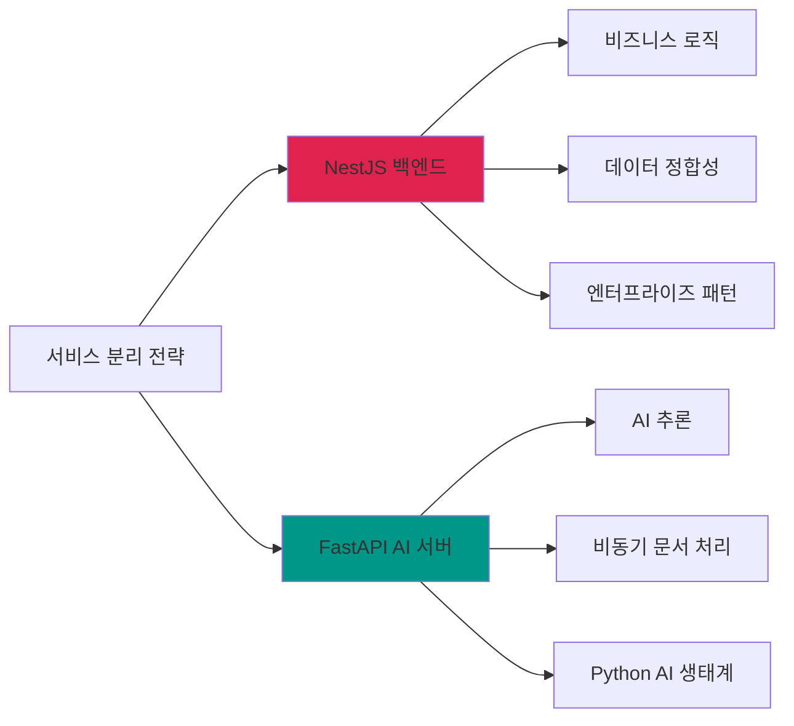
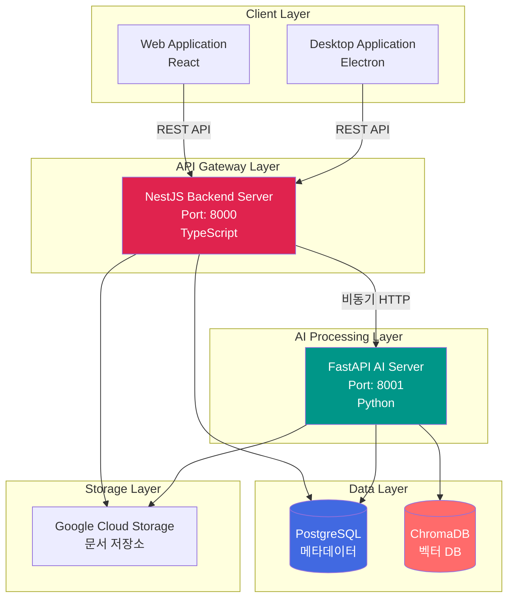
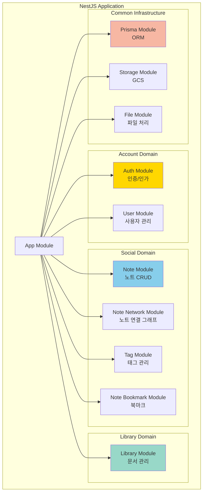
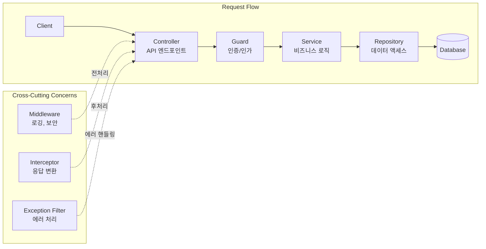
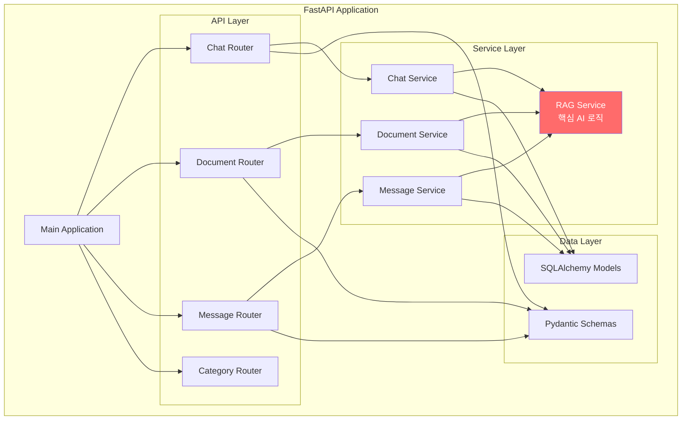
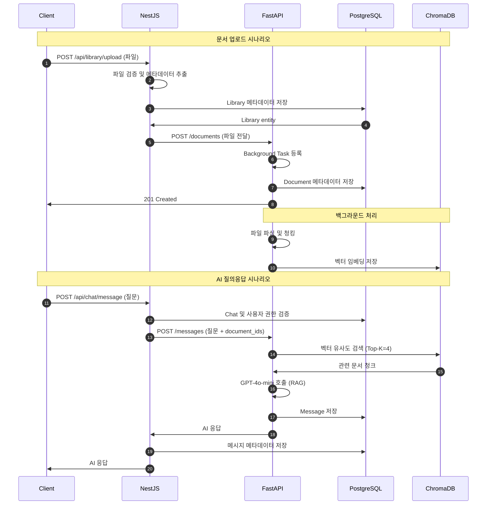

# System Architecture

> NewLearnNote 시스템 아키텍처 개요

## Table of Contents
- [1. 개요](#1-개요)
- [2. 시스템 아키텍처 개요](#2-시스템-아키텍처-개요)
- [3. NestJS 백엔드 서버](#3-nestjs-백엔드-서버)
- [4. FastAPI AI 서버](#4-fastapi-ai-서버)
- [5. 서비스 간 통합](#5-서비스-간-통합)
- [6. 결론 및 향후 개선](#6-결론-및-향후-개선)

---

## 1. 개요

### 1.1 프로젝트 배경

NewLearnNote는 학습 과정에서 발생하는 서비스 전환 문제(Obsidian, Notion, Blog 간 이동)를 해결하기 위한 통합 학습 플랫폼입니다.

**핵심 문제:**
- 기록(Obsidian), AI 질의응답, 지식 공유(Blog) 간 잦은 서비스 전환
- 학습 흐름 단절 및 집중력 저하
- 문서 컨텍스트를 이해하는 AI 부재

**솔루션:**
- 하나의 플랫폼에서 문서 업로드, AI 질의응답, 지식 공유 통합
- RAG(Retrieval-Augmented Generation) 기반 문서 컨텍스트 이해
- 멀티 플랫폼 지원 (Web + Desktop)

### 1.2 기술 스택 선택 이유

#### NestJS vs FastAPI 하이브리드 아키텍처

**Q. 왜 서로 다른 기술 스택을 혼합했는가?**

**NestJS (메인 서버):**
- ✅ **안정성**: TypeScript 기반 타입 안전성, 엔터프라이즈급 구조
- ✅ **유지보수성**: 모듈화된 구조, 의존성 주입(DI), 테스트 용이성
- ✅ **비즈니스 로직**: 사용자 인증, 권한 관리, 트랜잭션 처리 최적화
- ✅ **PostgreSQL 통합**: Prisma로 복잡한 관계형 데이터 모델링

**FastAPI (AI 서버):**
- ✅ **AI 생태계**: LangChain, OpenAI, ChromaDB 등 Python AI 라이브러리 활용
- ✅ **처리 효율**: Background Tasks를 통한 비동기 문서 처리 파이프라인
- ✅ **개발 속도**: 자동 API 문서화, Pydantic 타입 검증, 직관적인 라우팅
- ✅ **확장성**: RAG 파이프라인 독립 운영, AI 모델 교체 용이

---

## 2. 시스템 아키텍처 개요

### 2.1 High-Level Architecture

### 2.2 서비스 분리 전략

| 계층 | 책임 | 기술 스택 |
|------|------|-----------|
| **API Gateway** | 클라이언트 요청 라우팅, 인증/인가, 비즈니스 로직 | NestJS, JWT, Passport |
| **AI Processing** | 문서 파싱, 임베딩 생성, RAG 질의응답 | FastAPI, LangChain, OpenAI |
| **Data Storage** | 메타데이터 영속성, 벡터 검색 | PostgreSQL, ChromaDB |
| **File Storage** | 문서 파일 저장 및 Signed URL 생성 | Google Cloud Storage |

---

## 3. NestJS 백엔드 서버

### 3.1 모듈 구조

### 3.2 레이어 아키텍처

**주요 디자인 패턴:**
- **Module Pattern**: 기능별 독립 모듈로 관심사 분리
- **Dependency Injection**: IoC 컨테이너 기반 의존성 관리
- **Repository Pattern**: 데이터 액세스 로직 추상화
- **Guard Pattern**: 라우트 수준 인증/인가 검증

**상세 내용:**
- [인증/인가 플로우](./AUTH_FLOW.md) - Google OAuth 2.0, JWT, Refresh Token
- [파일 저장 전략](./FILE_STORAGE.md) - GCS, Signed URL, LibraryOwnerGuard

---

## 4. FastAPI AI 서버

### 4.1 서비스 구조

**핵심 기능:**
- **RAG Service**: 문서 임베딩, 벡터 검색, AI 응답 생성
- **Background Tasks**: 비동기 문서 처리 (파싱, 청킹, 임베딩)
- **Document Service**: 문서 메타데이터 관리
- **Chat Service**: 대화 히스토리 관리

**상세 내용:**
- [비동기 처리 전략](./ASYNC_PROCESSING.md) - Background Tasks, 성능 최적화

---

## 5. 서비스 간 통합

### 5.1 통합 방식

**현재 통합 상태:**
- 🔄 **독립 운영**: NestJS와 FastAPI는 각각 독립적으로 PostgreSQL 접근
- 🔄 **데이터 동기화**: 현재는 각 서버가 자체 데이터 모델 유지
- 🚀 **향후 개선**: NestJS에서 FastAPI로 HTTP 요청을 통한 통합 (계획)

**통합 포인트:**
1. **문서 업로드**: NestJS → FastAPI (파일 처리 위임)
2. **AI 질의응답**: NestJS → FastAPI (RAG 처리 요청)
3. **문서 삭제**: NestJS → FastAPI (벡터 스토어 동기화)

---

## 6. 결론 및 향후 개선

### 6.1 핵심 아키텍처 원칙

1. **관심사 분리 (Separation of Concerns)**
   - NestJS: 비즈니스 로직, 데이터 정합성
   - FastAPI: AI 추론, 문서 처리

2. **확장성 (Scalability)**
   - 서비스별 독립 확장 가능
   - Cloud Run Auto-scaling
   - 독립적인 데이터베이스 운영

3. **성능 최적화 (Performance)**
   - 비동기 Background Tasks
   - 벡터 검색 인덱싱 (HNSW)
   - In-Memory Rate Limiting

4. **보안 (Security)**
   - OAuth 2.0 + JWT
   - Refresh Token 재사용 방지
   - Guard 기반 권한 검증

5. **유지보수성 (Maintainability)**
   - 모듈화된 구조
   - 타입 안전성 (TypeScript, Pydantic)
   - 자동 API 문서화 (Swagger)

### 6.2 현재 제한사항

**Rate Limiting:**
- ⚠️ In-Memory 방식: 서버 재시작 시 데이터 손실
- ⚠️ 단일 서버 환경에만 적합
- ⚠️ 분산 환경 미지원

**서비스 통합:**
- 🔄 NestJS-FastAPI HTTP 통합 미구현
- 🔄 각 서버가 독립적으로 PostgreSQL 접근

### 6.3 향후 개선 방향

**성능 및 확장성:**
- [ ] **Redis 캐싱 도입**: 사용자 프로필, API 응답 캐싱으로 DB 부하 감소
- [ ] **Redis Rate Limiting**: 분산 환경 지원 및 영구 저장
- [ ] **NestJS-FastAPI HTTP Client**: 서비스 간 통합 API 구현
- [ ] **WebSocket 기반 실시간 AI 스트리밍**: 응답 생성 과정 실시간 표시

**검색 및 데이터:**
- [ ] **Elasticsearch 도입**: 전문 검색 강화 (제목, 내용 검색)
- [ ] **Redis Pub/Sub**: 서버 간 이벤트 전파 (문서 업데이트 동기화)
- [ ] **Query Caching**: 자주 조회되는 데이터 캐싱

**인프라:**
- [ ] **Kubernetes 마이그레이션**: 고급 오케스트레이션 및 서비스 메시 도입
- [ ] **Cloud Memorystore (Managed Redis)**: GCP 관리형 Redis 연동
- [ ] **Cloud CDN**: 정적 파일 전송 가속화

**모니터링 및 관찰성:**
- [ ] **Cloud Logging**: 중앙화된 로그 관리
- [ ] **Cloud Monitoring**: 성능 메트릭 수집 및 알람
- [ ] **Distributed Tracing**: 서비스 간 요청 추적

---

## 관련 문서

상세한 아키텍처 내용은 각 전문 문서를 참고하세요:

- [인증/인가 플로우](./AUTH_FLOW.md) - Google OAuth, JWT, Refresh Token
- [파일 저장 전략](./FILE_STORAGE.md) - GCS, Signed URL, 파일 트리
- [비동기 처리](./ASYNC_PROCESSING.md) - FastAPI Background Tasks
- [데이터베이스](./DATABASE.md) - PostgreSQL, ChromaDB, 인덱싱
- [RAG 파이프라인](./RAG_PIPELINE.md) - 문서 처리, 검색, 응답 생성
- [클라우드 인프라](./INFRASTRUCTURE.md) - Cloud Run, Docker, 배포
- [보안](./SECURITY.md) - 인증, 암호화, API 보안
- [성능 최적화](./PERFORMANCE.md) - Rate Limiting, 캐싱, 벡터 검색
