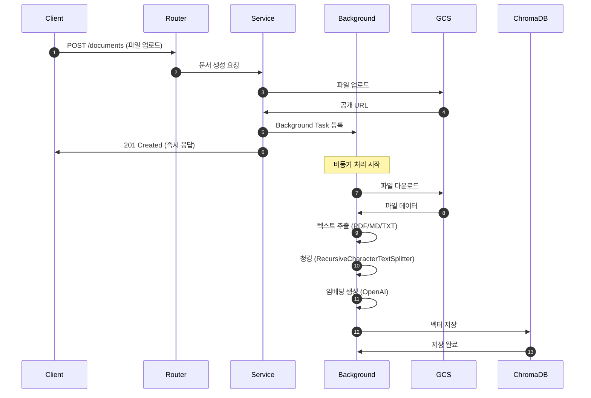
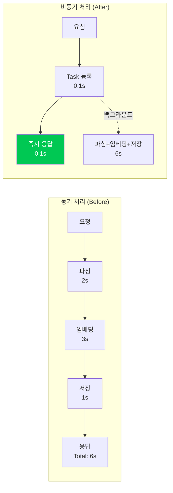
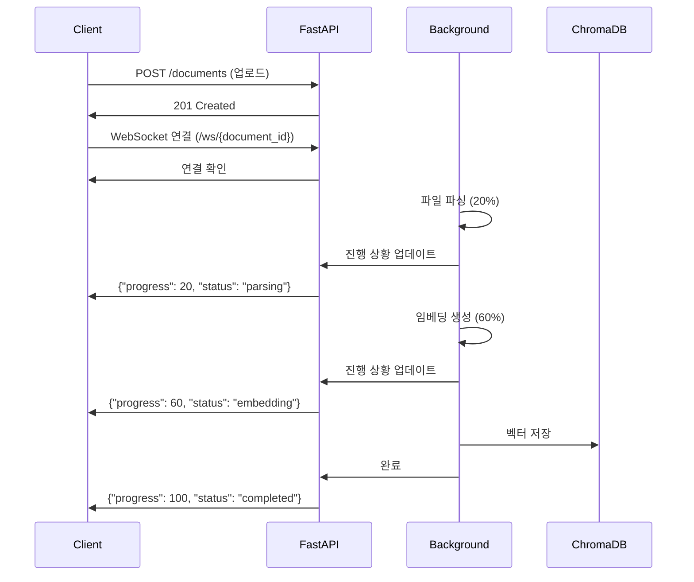

# FastAPI Async Processing

> FastAPI Background Tasks를 활용한 비동기 문서 처리 전략

## Table of Contents
- [1. 개요](#1-개요)
- [2. Background Tasks 아키텍처](#2-background-tasks-아키텍처)
- [3. 문서 업로드 비동기 처리](#3-문서-업로드-비동기-처리)
- [4. 성능 최적화](#4-성능-최적화)

---

## 1. 개요

FastAPI는 **Background Tasks**를 제공하여 시간이 오래 걸리는 작업을 백그라운드에서 비동기로 처리할 수 있습니다.

### 1.1 비동기 처리가 필요한 이유

**문서 처리 과정:**
1. 파일 다운로드 (GCS) - **1초**
2. 텍스트 추출 (PDF/MD/TXT) - **2초**
3. 청킹 (RecursiveCharacterTextSplitter) - **1초**
4. 임베딩 생성 (OpenAI API) - **3초**
5. 벡터 저장 (ChromaDB) - **1초**

**총 처리 시간: 8초**

**문제점:**
- ❌ 사용자가 8초 동안 대기
- ❌ HTTP 타임아웃 위험
- ❌ 나쁜 UX

**해결책 (Background Tasks):**
- ✅ 즉시 응답 (201 Created)
- ✅ 백그라운드에서 처리
- ✅ 사용자 대기 시간 **0.1초**

---

## 2. Background Tasks 아키텍처

### 2.1 전체 플로우



### 2.2 처리 시간 비교



**UX 개선:**
- **동기 처리**: 6초 대기
- **비동기 처리**: 0.1초 대기
- **60배 빠른 응답**

---

## 3. 문서 업로드 비동기 처리

### 3.1 Document Router

```python
# app/routers/documents.py
from fastapi import APIRouter, UploadFile, BackgroundTasks, Depends
from app.services.document_service import DocumentService

router = APIRouter(prefix="/documents", tags=["documents"])

@router.post("", status_code=201)
async def create_document(
    file: UploadFile,
    background_tasks: BackgroundTasks,
    db: AsyncSession = Depends(get_db)
):
    """
    문서 업로드 (비동기 처리)

    1. 파일을 GCS에 업로드
    2. PostgreSQL에 메타데이터 저장
    3. Background Task 등록 (파싱, 임베딩, 벡터 저장)
    4. 즉시 응답 (201 Created)
    """

    # 1. 파일 업로드 (GCS)
    document_id = str(uuid4())
    file_path = await upload_to_gcs(file, f"user-documents/{document_id}.pdf")

    # 2. 메타데이터 저장 (PostgreSQL)
    document = await DocumentService.create_document(
        db=db,
        document_id=document_id,
        filename=file.filename,
        file_path=file_path,
        file_size=file.size
    )

    # 3. Background Task 등록
    background_tasks.add_task(
        process_document,
        document_id=document_id,
        file_path=file_path
    )

    # 4. 즉시 응답
    return {
        "id": document_id,
        "filename": file.filename,
        "status": "processing"  # 처리 중
    }
```

### 3.2 Background Task 함수

```python
# app/services/document_service.py
async def process_document(document_id: str, file_path: str):
    """
    백그라운드에서 문서 처리

    1. GCS에서 파일 다운로드
    2. 텍스트 추출 (PDF/MD/TXT)
    3. 청킹 (RecursiveCharacterTextSplitter)
    4. 임베딩 생성 (OpenAI)
    5. 벡터 저장 (ChromaDB)
    6. PostgreSQL 업데이트 (total_chunks, status)
    """

    try:
        # 1. 파일 다운로드
        file_data = await download_from_gcs(file_path)

        # 2. 텍스트 추출
        text = extract_text(file_data, file_type="pdf")

        # 3. 청킹
        from app.services.rag_service import RAGService
        chunks = RAGService.split_text(text)

        # 4. 임베딩 생성 + 벡터 저장
        total_chunks = await RAGService.add_document_to_vectorstore(
            document_id=document_id,
            text=text,
            metadata={
                "filename": file_path.split("/")[-1],
                "fileType": "pdf"
            }
        )

        # 5. PostgreSQL 업데이트
        async with get_db() as db:
            await db.execute(
                update(Document)
                .where(Document.id == document_id)
                .values(
                    total_chunks=total_chunks,
                    status="completed"
                )
            )
            await db.commit()

        print(f"✅ Document {document_id} processed successfully")

    except Exception as e:
        print(f"❌ Error processing document {document_id}: {e}")

        # 에러 상태 업데이트
        async with get_db() as db:
            await db.execute(
                update(Document)
                .where(Document.id == document_id)
                .values(status="failed", error_message=str(e))
            )
            await db.commit()
```

### 3.3 텍스트 추출 함수

```python
# app/utils/text_extraction.py
from pypdf import PdfReader
from io import BytesIO

def extract_text(file_data: bytes, file_type: str) -> str:
    """
    파일 타입별 텍스트 추출

    지원 형식:
    - PDF: pypdf
    - Markdown: 그대로 반환
    - Text: 그대로 반환
    """

    if file_type == "pdf":
        # PDF 파싱
        pdf_reader = PdfReader(BytesIO(file_data))
        text = ""
        for page in pdf_reader.pages:
            text += page.extract_text() + "\n\n"
        return text

    elif file_type == "md" or file_type == "txt":
        # 텍스트 파일
        return file_data.decode("utf-8")

    else:
        raise ValueError(f"Unsupported file type: {file_type}")
```

---

## 4. 성능 최적화

### 4.1 처리 상태 조회

**문서 상태 확인 API:**
```python
@router.get("/{document_id}/status")
async def get_document_status(
    document_id: str,
    db: AsyncSession = Depends(get_db)
):
    """
    문서 처리 상태 조회

    상태:
    - processing: 처리 중
    - completed: 완료
    - failed: 실패
    """

    document = await db.get(Document, document_id)

    if not document:
        raise HTTPException(status_code=404, detail="Document not found")

    return {
        "id": document.id,
        "filename": document.filename,
        "status": document.status,
        "total_chunks": document.total_chunks,
        "created_at": document.created_at
    }
```

**클라이언트 폴링:**
```typescript
// 문서 업로드 후 상태 확인
async function uploadDocument(file: File) {
  // 1. 업로드
  const response = await fetch('/documents', {
    method: 'POST',
    body: formData
  });

  const { id } = await response.json();

  // 2. 상태 폴링 (5초마다)
  const interval = setInterval(async () => {
    const status = await fetch(`/documents/${id}/status`).then(r => r.json());

    if (status.status === 'completed') {
      clearInterval(interval);
      console.log('✅ 문서 처리 완료!');
    } else if (status.status === 'failed') {
      clearInterval(interval);
      console.error('❌ 문서 처리 실패');
    }
  }, 5000);
}
```

### 4.2 병렬 처리 (여러 문서)

**여러 문서 동시 업로드:**
```python
@router.post("/batch", status_code=201)
async def create_documents_batch(
    files: list[UploadFile],
    background_tasks: BackgroundTasks,
    db: AsyncSession = Depends(get_db)
):
    """
    여러 문서 일괄 업로드
    """

    document_ids = []

    for file in files:
        document_id = str(uuid4())
        file_path = await upload_to_gcs(file, f"user-documents/{document_id}.pdf")

        # 메타데이터 저장
        document = await DocumentService.create_document(
            db=db,
            document_id=document_id,
            filename=file.filename,
            file_path=file_path,
            file_size=file.size
        )

        # Background Task 등록
        background_tasks.add_task(
            process_document,
            document_id=document_id,
            file_path=file_path
        )

        document_ids.append(document_id)

    return {
        "documents": document_ids,
        "status": "processing"
    }
```

### 4.3 에러 핸들링

**재시도 로직:**
```python
from tenacity import retry, stop_after_attempt, wait_exponential

@retry(
    stop=stop_after_attempt(3),  # 최대 3번 재시도
    wait=wait_exponential(multiplier=1, min=4, max=10)  # 지수 백오프
)
async def generate_embeddings(chunks: list[str]) -> list[list[float]]:
    """
    임베딩 생성 (재시도 로직 포함)
    """

    embeddings = OpenAIEmbeddings(
        openai_api_key=settings.OPENAI_API_KEY,
        model=settings.EMBEDDING_MODEL
    )

    return await embeddings.aembed_documents(chunks)
```

---

## 5. WebSocket을 통한 실시간 진행 상황 (향후 개선)

### 5.1 WebSocket 아키텍처



**WebSocket 엔드포인트 (향후 구현):**
```python
from fastapi import WebSocket

@app.websocket("/ws/{document_id}")
async def websocket_endpoint(websocket: WebSocket, document_id: str):
    await websocket.accept()

    # 진행 상황 실시간 전송
    while True:
        status = await get_document_status(document_id)
        await websocket.send_json(status)

        if status["status"] in ["completed", "failed"]:
            break

        await asyncio.sleep(1)

    await websocket.close()
```

---

## 참고 자료

- [FastAPI Background Tasks](https://fastapi.tiangolo.com/tutorial/background-tasks/)
- [Python asyncio](https://docs.python.org/3/library/asyncio.html)
- [Tenacity (Retry Library)](https://tenacity.readthedocs.io/)
