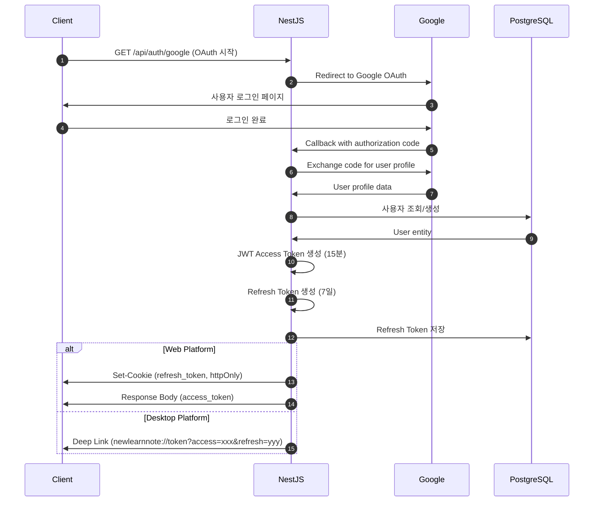
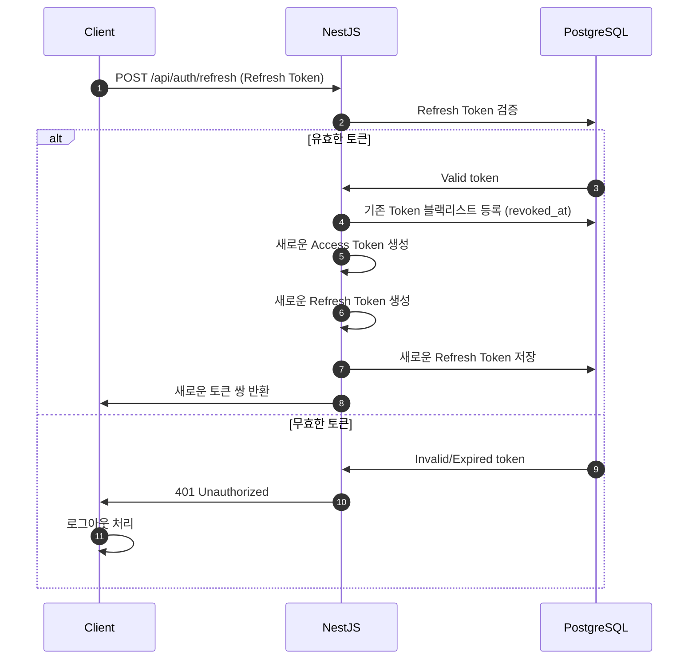

# Authentication & Authorization Flow

> NewLearnNote 인증/인가 시스템 상세 설명

## Table of Contents
- [1. 개요](#1-개요)
- [2. Google OAuth 2.0 플로우](#2-google-oauth-20-플로우)
- [3. JWT 토큰 관리](#3-jwt-토큰-관리)
- [4. 멀티 플랫폼 인증](#4-멀티-플랫폼-인증)
- [5. 토큰 갱신 전략](#5-토큰-갱신-전략)

---

## 1. 개요

NewLearnNote는 Google OAuth 2.0 기반 소셜 로그인과 JWT 토큰 기반 인증을 사용합니다.

### 1.1 인증 방식

**OAuth 2.0 + JWT 하이브리드:**
- **Google OAuth 2.0**: 신뢰할 수 있는 신원 확인
- **JWT Access Token**: 상태 없는(stateless) API 인증
- **Refresh Token**: 장기 세션 유지

### 1.2 멀티 플랫폼 지원

| 플랫폼 | 토큰 전달 방식 | 특징 |
|--------|----------------|------|
| **Web** | Cookie (httpOnly, Secure) | XSS 공격 방지 |
| **Desktop** | Deep Link | 크로스 플랫폼 인증 |

---

## 2. Google OAuth 2.0 플로우

### 2.1 전체 인증 플로우



### 2.2 OAuth 엔드포인트

**로그인 시작:**
```typescript
// GET /api/auth/google
@Get('google')
@UseGuards(AuthGuard('google'))
async googleAuth() {
  // Google OAuth 페이지로 리다이렉트
}
```

**OAuth 콜백:**
```typescript
// GET /api/auth/google/callback
@Get('google/callback')
@UseGuards(AuthGuard('google'))
async googleAuthCallback(@Req() req, @Res() res) {
  const user = req.user;

  // JWT 토큰 생성
  const accessToken = this.authService.generateAccessToken(user);
  const refreshToken = await this.authService.generateRefreshToken(user);

  // 플랫폼별 응답
  if (req.query.platform === 'desktop') {
    // Desktop: Deep Link
    return res.redirect(
      `newlearnnote://token?access=${accessToken}&refresh=${refreshToken}`
    );
  } else {
    // Web: Cookie
    res.cookie('refresh_token', refreshToken, {
      httpOnly: true,
      secure: true,
      sameSite: 'strict',
      maxAge: 7 * 24 * 60 * 60 * 1000 // 7일
    });

    return res.json({ accessToken });
  }
}
```

---

## 3. JWT 토큰 관리

### 3.1 Access Token

**특징:**
- 유효 기간: **15분**
- 저장소: 클라이언트 메모리 (Web: localStorage 금지)
- 타입: JWT (JSON Web Token)
- 페이로드: 사용자 ID, 이메일, 역할

**생성 코드:**
```typescript
generateAccessToken(user: User): string {
  const payload = {
    sub: user.id,
    email: user.email,
    name: user.name,
    role: user.role
  };

  return this.jwtService.sign(payload, {
    secret: process.env.JWT_SECRET,
    expiresIn: '15m'
  });
}
```

**페이로드 구조:**
```json
{
  "sub": "uuid-user-id",
  "email": "user@example.com",
  "name": "홍길동",
  "role": "user",
  "iat": 1234567890,
  "exp": 1234568790
}
```

### 3.2 Refresh Token

**특징:**
- 유효 기간: **7일**
- 저장소: PostgreSQL (서버 측 관리)
- 타입: UUID v4 (랜덤)
- 용도: Access Token 갱신

**저장 구조 (PostgreSQL):**
```sql
CREATE TABLE "RefreshToken" (
  id UUID PRIMARY KEY,
  user_id UUID NOT NULL REFERENCES "User"(id),
  token TEXT NOT NULL UNIQUE,
  expires_at TIMESTAMP NOT NULL,
  created_at TIMESTAMP DEFAULT NOW(),
  revoked_at TIMESTAMP NULL  -- 토큰 무효화
);

CREATE INDEX idx_refresh_token_user ON "RefreshToken"(user_id);
CREATE INDEX idx_refresh_token_token ON "RefreshToken"(token);
```

**생성 코드:**
```typescript
async generateRefreshToken(user: User): Promise<string> {
  const token = uuidv4();
  const expiresAt = new Date();
  expiresAt.setDate(expiresAt.getDate() + 7); // 7일 후

  await this.prisma.refreshToken.create({
    data: {
      userId: user.id,
      token,
      expiresAt
    }
  });

  return token;
}
```

---

## 4. 멀티 플랫폼 인증

### 4.1 Web 플랫폼

**토큰 저장:**
- **Access Token**: 메모리 (React state, Zustand 등)
- **Refresh Token**: httpOnly Cookie

**Cookie 설정:**
```typescript
res.cookie('refresh_token', refreshToken, {
  httpOnly: true,    // JavaScript 접근 불가 (XSS 방지)
  secure: true,      // HTTPS only
  sameSite: 'strict', // CSRF 방지
  maxAge: 7 * 24 * 60 * 60 * 1000 // 7일
});
```

**API 요청:**
```typescript
// Authorization 헤더에 Access Token 포함
fetch('/api/protected', {
  headers: {
    'Authorization': `Bearer ${accessToken}`
  },
  credentials: 'include' // Cookie 포함
});
```

### 4.2 Desktop 플랫폼 (Electron)

**Deep Link 처리:**
```typescript
// OAuth 콜백 시
const deepLink = `newlearnnote://token?access=${accessToken}&refresh=${refreshToken}`;
res.redirect(deepLink);
```

**Electron 앱에서 수신:**
```javascript
// main.js (Electron)
app.on('open-url', (event, url) => {
  const params = new URLSearchParams(url.split('?')[1]);
  const accessToken = params.get('access');
  const refreshToken = params.get('refresh');

  // 안전한 저장소에 저장 (electron-store 등)
  store.set('accessToken', accessToken);
  store.set('refreshToken', refreshToken);
});
```

**API 요청:**
```typescript
// Authorization 헤더에 Access Token 포함
fetch('/api/protected', {
  headers: {
    'Authorization': `Bearer ${accessToken}`,
    'X-Refresh-Token': refreshToken // Refresh Token도 헤더로 전달
  }
});
```

---

## 5. 토큰 갱신 전략

### 5.1 토큰 갱신 플로우



### 5.2 토큰 갱신 API

**엔드포인트:**
```typescript
// POST /api/auth/refresh
@Post('refresh')
async refresh(@Req() req, @Res() res) {
  const refreshToken = req.cookies?.refresh_token || req.headers['x-refresh-token'];

  if (!refreshToken) {
    throw new UnauthorizedException('Refresh token not found');
  }

  // 1. Refresh Token 검증
  const storedToken = await this.prisma.refreshToken.findUnique({
    where: { token: refreshToken },
    include: { user: true }
  });

  if (!storedToken || storedToken.expiresAt < new Date() || storedToken.revokedAt) {
    throw new UnauthorizedException('Invalid refresh token');
  }

  // 2. 기존 토큰 무효화 (재사용 방지)
  await this.prisma.refreshToken.update({
    where: { id: storedToken.id },
    data: { revokedAt: new Date() }
  });

  // 3. 새로운 토큰 쌍 생성
  const newAccessToken = this.generateAccessToken(storedToken.user);
  const newRefreshToken = await this.generateRefreshToken(storedToken.user);

  // 4. 응답
  if (req.query.platform === 'desktop') {
    return res.json({
      accessToken: newAccessToken,
      refreshToken: newRefreshToken
    });
  } else {
    res.cookie('refresh_token', newRefreshToken, {
      httpOnly: true,
      secure: true,
      sameSite: 'strict',
      maxAge: 7 * 24 * 60 * 60 * 1000
    });

    return res.json({ accessToken: newAccessToken });
  }
}
```

### 5.3 자동 갱신 로직 (Client)

**Web (React 예시):**
```typescript
// axios interceptor
axios.interceptors.response.use(
  (response) => response,
  async (error) => {
    const originalRequest = error.config;

    // Access Token 만료 시 (401)
    if (error.response?.status === 401 && !originalRequest._retry) {
      originalRequest._retry = true;

      try {
        // Refresh Token으로 갱신
        const { data } = await axios.post('/api/auth/refresh', {}, {
          withCredentials: true // Cookie 포함
        });

        // 새 Access Token 저장
        setAccessToken(data.accessToken);

        // 원래 요청 재시도
        originalRequest.headers['Authorization'] = `Bearer ${data.accessToken}`;
        return axios(originalRequest);
      } catch (refreshError) {
        // Refresh Token도 만료 → 로그아웃
        logout();
        return Promise.reject(refreshError);
      }
    }

    return Promise.reject(error);
  }
);
```

---

## 6. 보호된 리소스 접근

### 6.1 JWT Guard

```typescript
// jwt.strategy.ts
@Injectable()
export class JwtStrategy extends PassportStrategy(Strategy) {
  constructor(private prisma: PrismaService) {
    super({
      jwtFromRequest: ExtractJwt.fromAuthHeaderAsBearerToken(),
      secretOrKey: process.env.JWT_SECRET
    });
  }

  async validate(payload: any) {
    // 사용자 존재 여부 확인
    const user = await this.prisma.user.findUnique({
      where: { id: payload.sub }
    });

    if (!user) {
      throw new UnauthorizedException();
    }

    return user; // req.user에 주입
  }
}
```

**사용 예시:**
```typescript
// 보호된 엔드포인트
@Get('profile')
@UseGuards(JwtAuthGuard)
async getProfile(@Req() req) {
  return req.user; // JwtStrategy에서 주입된 사용자 정보
}
```

---

## 7. 보안 고려사항

### 7.1 토큰 재사용 방지

**Refresh Token Rotation:**
- 토큰 갱신 시 **기존 Refresh Token 즉시 무효화**
- `revoked_at` 타임스탬프 기록
- 재사용 시도 감지 → 모든 토큰 무효화 (보안 위협)

### 7.2 XSS 방지

**Web 플랫폼:**
- Refresh Token: **httpOnly Cookie** (JavaScript 접근 불가)
- Access Token: **메모리 저장** (localStorage 금지)
- CSP (Content Security Policy) 헤더 설정

### 7.3 CSRF 방지

**Cookie 설정:**
```typescript
{
  sameSite: 'strict',  // 크로스 사이트 요청 차단
  secure: true         // HTTPS only
}
```

### 7.4 토큰 만료 시간

| 토큰 | 만료 시간 | 이유 |
|------|-----------|------|
| Access Token | **15분** | 짧은 수명으로 탈취 위험 최소화 |
| Refresh Token | **7일** | 사용자 편의성과 보안 균형 |

---

## 8. 로그아웃 처리

### 8.1 로그아웃 API

```typescript
@Post('logout')
@UseGuards(JwtAuthGuard)
async logout(@Req() req, @Res() res) {
  const refreshToken = req.cookies?.refresh_token || req.headers['x-refresh-token'];

  if (refreshToken) {
    // Refresh Token 무효화
    await this.prisma.refreshToken.updateMany({
      where: { token: refreshToken },
      data: { revokedAt: new Date() }
    });
  }

  // Cookie 삭제
  res.clearCookie('refresh_token');

  return res.json({ message: 'Logged out successfully' });
}
```

### 8.2 전체 세션 무효화

```typescript
// 특정 사용자의 모든 Refresh Token 무효화
async revokeAllUserTokens(userId: string) {
  await this.prisma.refreshToken.updateMany({
    where: {
      userId,
      revokedAt: null
    },
    data: { revokedAt: new Date() }
  });
}
```

---

## 참고 자료

- [NestJS Authentication](https://docs.nestjs.com/security/authentication)
- [Passport.js](http://www.passportjs.org/)
- [Google OAuth 2.0](https://developers.google.com/identity/protocols/oauth2)
- [JWT Best Practices](https://tools.ietf.org/html/rfc8725)
