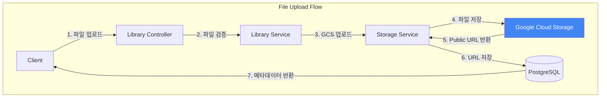
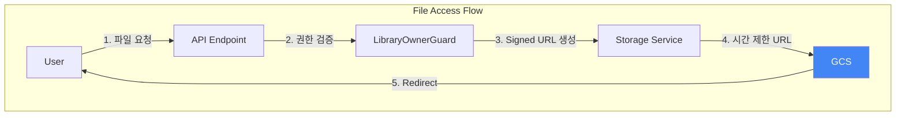
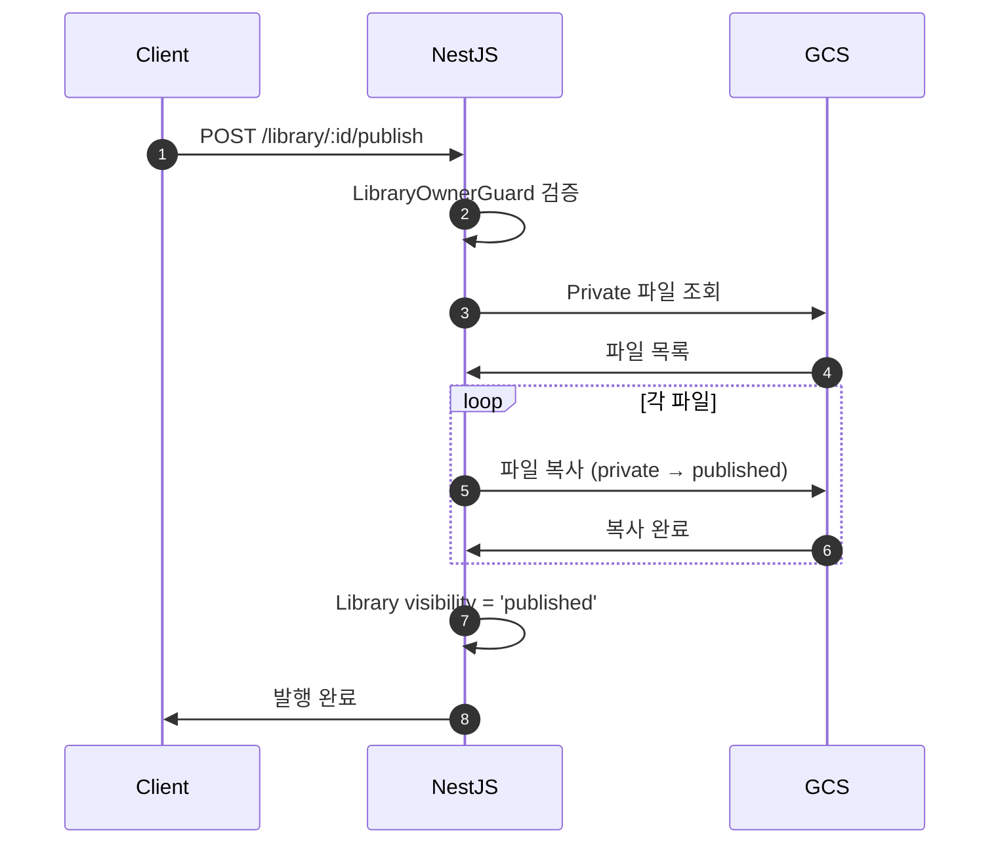

# File Storage Strategy

> Google Cloud Storage 파일 저장 및 관리 전략

## Table of Contents
- [1. 개요](#1-개요)
- [2. GCS 폴더 구조](#2-gcs-폴더-구조)
- [3. 파일 업로드 플로우](#3-파일-업로드-플로우)
- [4. Signed URL 전략](#4-signed-url-전략)
- [5. 라이브러리 파일 관리](#5-라이브러리-파일-관리)

---

## 1. 개요

NewLearnNote는 모든 파일을 **Google Cloud Storage (GCS)**에 저장하며, 보안과 성능을 위해 **Signed URL** 전략을 사용합니다.

### 1.1 GCS 선택 이유

| 장점 | 설명 |
|------|------|
| **확장성** | 무제한 스토리지, 자동 스케일링 |
| **보안** | 서버 측 암호화, IAM 권한 관리 |
| **성능** | CDN 통합, 전 세계 엣지 캐싱 |
| **비용 효율** | 저렴한 스토리지 비용, 종량제 |
| **Signed URL** | 시간 제한 URL로 안전한 파일 접근 |

### 1.2 파일 저장 원칙

- ✅ **로컬 저장 금지**: 모든 파일은 GCS에 직접 업로드
- ✅ **UUID 기반 파일명**: 충돌 방지 및 예측 불가능성
- ✅ **Public/Private 분리**: 공개 파일과 비공개 파일 분리
- ✅ **Signed URL**: Private 파일 접근 시 시간 제한 URL 생성

---

## 2. GCS 폴더 구조

### 2.1 Bucket 구조

```
newlearnnote-bk-test/
├── user-documents/          # AI 문서 분석용
│   └── {document_id}.{ext}  # UUID 기반 파일명
│       예: a1b2c3d4-5678-90ab-cdef-1234567890ab.pdf
│
├── user-avatar/             # 프로필 이미지
│   ├── default-avatar.png   # 기본 아바타
│   └── {user_id}.{ext}      # 사용자별 아바타
│       예: user-123.jpg
│
└── library-files/           # 라이브러리 파일 (Obsidian-like)
    ├── private/             # 작성 중 문서 (Private)
    │   └── {library_id}/
    │       ├── notes/
    │       │   └── note1.md
    │       ├── assets/
    │       │   └── image.png
    │       └── attachments/
    │           └── file.pdf
    │
    └── published/           # 공개된 문서 (Published)
        └── {library_id}/
            ├── notes/
            ├── assets/
            └── attachments/
```

### 2.2 환경 변수 설정

```env
# GCP Configuration
GCP_PROJECT_ID=newlearnnote-project
GCP_BUCKET_NAME=newlearnnote-bk-test
GOOGLE_APPLICATION_CREDENTIALS=./service-account-key.json

# GCS URLs
USER_DEFAULT_AVATAR_URL=https://storage.googleapis.com/newlearnnote-bk-test/user-avatar/default-avatar.png
USER_AVATAR_URLS=https://storage.googleapis.com/newlearnnote-bk-test/user-avatar/
USER_DOCUMENTS_URL=https://storage.googleapis.com/newlearnnote-bk-test/user-documents/
```

---

## 3. 파일 업로드 플로우

### 3.1 전체 플로우



### 3.2 파일 업로드 코드

**Controller (NestJS):**
```typescript
@Post('upload')
@UseGuards(JwtAuthGuard)
@UseInterceptors(FileInterceptor('file'))
async uploadFile(
  @UploadedFile() file: Express.Multer.File,
  @Req() req
) {
  // 파일 검증
  const allowedTypes = ['application/pdf', 'text/markdown', 'text/plain'];
  if (!allowedTypes.includes(file.mimetype)) {
    throw new BadRequestException('Unsupported file type');
  }

  const maxSize = 50 * 1024 * 1024; // 50MB
  if (file.size > maxSize) {
    throw new BadRequestException('File too large');
  }

  // GCS 업로드
  const documentId = uuidv4();
  const ext = file.originalname.split('.').pop();
  const gcsPath = `user-documents/${documentId}.${ext}`;

  const publicUrl = await this.storageService.uploadFile(
    file.buffer,
    gcsPath,
    file.mimetype
  );

  // PostgreSQL 메타데이터 저장
  const document = await this.prisma.document.create({
    data: {
      id: documentId,
      userId: req.user.id,
      filename: file.originalname,
      filePath: publicUrl,
      fileSize: file.size,
      fileType: ext
    }
  });

  return document;
}
```

**Storage Service:**
```typescript
import { Storage } from '@google-cloud/storage';

@Injectable()
export class StorageService {
  private storage: Storage;
  private bucket: any;

  constructor() {
    this.storage = new Storage({
      projectId: process.env.GCP_PROJECT_ID,
      keyFilename: process.env.GOOGLE_APPLICATION_CREDENTIALS
    });
    this.bucket = this.storage.bucket(process.env.GCP_BUCKET_NAME);
  }

  async uploadFile(
    buffer: Buffer,
    path: string,
    mimetype: string
  ): Promise<string> {
    const file = this.bucket.file(path);

    await file.save(buffer, {
      metadata: {
        contentType: mimetype
      },
      public: true // 공개 URL 생성
    });

    // 공개 URL 반환
    return `https://storage.googleapis.com/${process.env.GCP_BUCKET_NAME}/${path}`;
  }
}
```

---

## 4. Signed URL 전략

### 4.1 Signed URL이란?

**시간 제한 접근 URL:**
- 일정 시간 동안만 유효한 URL
- Private 파일에 대한 안전한 접근 제공
- URL 생성 시 서명 포함 (변조 불가)

### 4.2 파일 접근 플로우



### 4.3 Signed URL 생성 코드

**Library Controller:**
```typescript
@Get(':id/file')
@UseGuards(JwtAuthGuard, LibraryOwnerGuard)
async getFile(@Param('id') libraryId: string, @Query('path') filePath: string) {
  // Signed URL 생성 (5분 유효)
  const signedUrl = await this.storageService.generateSignedUrl(
    `library-files/private/${libraryId}/${filePath}`,
    5 * 60 // 5분
  );

  return { url: signedUrl };
}
```

**Storage Service:**
```typescript
async generateSignedUrl(
  path: string,
  expiresIn: number = 300 // 기본 5분
): Promise<string> {
  const file = this.bucket.file(path);

  const [signedUrl] = await file.getSignedUrl({
    action: 'read',
    expires: Date.now() + expiresIn * 1000
  });

  return signedUrl;
}
```

**생성된 Signed URL 예시:**
```
https://storage.googleapis.com/newlearnnote-bk-test/library-files/private/lib-123/note.md?
X-Goog-Algorithm=GOOG4-RSA-SHA256&
X-Goog-Credential=...&
X-Goog-Date=20260212T120000Z&
X-Goog-Expires=300&
X-Goog-SignedHeaders=host&
X-Goog-Signature=...
```

---

## 5. 라이브러리 파일 관리

### 5.1 Private vs Published

**Private (작성 중):**
- 경로: `library-files/private/{library_id}/`
- 접근: LibraryOwnerGuard로 소유자만 접근
- URL: Signed URL (5분 유효)

**Published (공개):**
- 경로: `library-files/published/{library_id}/`
- 접근: 모든 사용자 접근 가능
- URL: Public URL (영구)

### 5.2 LibraryOwnerGuard

```typescript
@Injectable()
export class LibraryOwnerGuard implements CanActivate {
  constructor(private prisma: PrismaService) {}

  async canActivate(context: ExecutionContext): Promise<boolean> {
    const request = context.switchToHttp().getRequest();
    const user = request.user;
    const libraryId = request.params.id;

    const library = await this.prisma.library.findUnique({
      where: { id: libraryId }
    });

    if (!library) {
      throw new NotFoundException('Library not found');
    }

    if (library.userId !== user.id) {
      throw new ForbiddenException('권한이 없습니다.');
    }

    return true;
  }
}
```

### 5.3 발행(Publish) 플로우



**발행 코드:**
```typescript
@Post(':id/publish')
@UseGuards(JwtAuthGuard, LibraryOwnerGuard)
async publishLibrary(@Param('id') libraryId: string) {
  const privatePath = `library-files/private/${libraryId}/`;
  const publishedPath = `library-files/published/${libraryId}/`;

  // Private 폴더의 모든 파일 조회
  const [files] = await this.bucket.getFiles({ prefix: privatePath });

  // Published 폴더로 복사
  for (const file of files) {
    const newPath = file.name.replace(privatePath, publishedPath);
    await file.copy(newPath);
  }

  // Library 상태 업데이트
  await this.prisma.library.update({
    where: { id: libraryId },
    data: { visibility: 'published' }
  });

  return { message: 'Published successfully' };
}
```

---

## 6. 파일 트리 조회

### 6.1 파일 트리 API

```typescript
@Get(':id/tree')
@UseGuards(JwtAuthGuard, LibraryOwnerGuard)
async getFileTree(@Param('id') libraryId: string) {
  const prefix = `library-files/private/${libraryId}/`;
  const [files] = await this.bucket.getFiles({ prefix });

  // 파일 트리 구조 생성
  const tree = this.buildFileTree(files, prefix);
  return tree;
}

private buildFileTree(files: any[], prefix: string): any {
  const tree: any = { type: 'folder', name: '/', children: [] };

  for (const file of files) {
    const relativePath = file.name.replace(prefix, '');
    const parts = relativePath.split('/').filter(Boolean);

    let current = tree;
    for (let i = 0; i < parts.length; i++) {
      const part = parts[i];
      const isFile = i === parts.length - 1;

      let child = current.children.find((c: any) => c.name === part);
      if (!child) {
        child = {
          type: isFile ? 'file' : 'folder',
          name: part,
          path: parts.slice(0, i + 1).join('/'),
          children: isFile ? undefined : []
        };
        current.children.push(child);
      }

      if (!isFile) {
        current = child;
      }
    }
  }

  return tree;
}
```

**응답 예시:**
```json
{
  "type": "folder",
  "name": "/",
  "children": [
    {
      "type": "folder",
      "name": "notes",
      "path": "notes",
      "children": [
        {
          "type": "file",
          "name": "README.md",
          "path": "notes/README.md"
        }
      ]
    },
    {
      "type": "folder",
      "name": "assets",
      "path": "assets",
      "children": []
    }
  ]
}
```

---

## 7. 파일 삭제

### 7.1 Soft Delete

**PostgreSQL에서만 삭제 (Soft Delete):**
```typescript
@Delete('document/:id')
@UseGuards(JwtAuthGuard)
async deleteDocument(@Param('id') documentId: string, @Req() req) {
  const document = await this.prisma.document.findUnique({
    where: { id: documentId }
  });

  if (document.userId !== req.user.id) {
    throw new ForbiddenException();
  }

  // Soft Delete
  await this.prisma.document.update({
    where: { id: documentId },
    data: { deletedAt: new Date() }
  });

  return { message: 'Document deleted' };
}
```

**GCS에서 실제 삭제 (선택적):**
```typescript
async deleteFile(path: string): Promise<void> {
  const file = this.bucket.file(path);
  await file.delete();
}
```

---

## 8. 보안 고려사항

### 8.1 파일 업로드 검증

**허용된 파일 타입:**
```typescript
const ALLOWED_TYPES = {
  'application/pdf': 'pdf',
  'text/markdown': 'md',
  'text/plain': 'txt',
  'image/jpeg': 'jpg',
  'image/png': 'png'
};
```

**파일 크기 제한:**
```typescript
const MAX_FILE_SIZE = 50 * 1024 * 1024; // 50MB
```

### 8.2 Signed URL 보안

- ✅ **짧은 유효 시간**: 5분 (필요 시 조정)
- ✅ **서명 검증**: GCS가 자동 검증
- ✅ **변조 불가**: URL 변경 시 서명 무효화

### 8.3 IAM 권한 관리

**Service Account 권한:**
```json
{
  "role": "roles/storage.objectAdmin",
  "members": [
    "serviceAccount:newlearnnote@project.iam.gserviceaccount.com"
  ]
}
```

---

## 참고 자료

- [Google Cloud Storage Documentation](https://cloud.google.com/storage/docs)
- [Signed URLs](https://cloud.google.com/storage/docs/access-control/signed-urls)
- [@google-cloud/storage NPM](https://www.npmjs.com/package/@google-cloud/storage)
