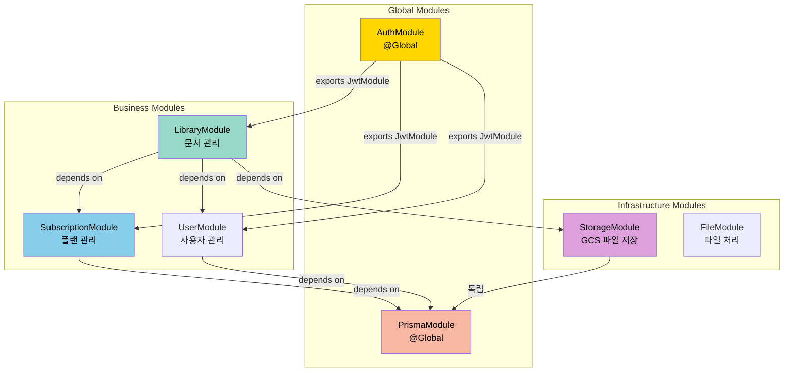
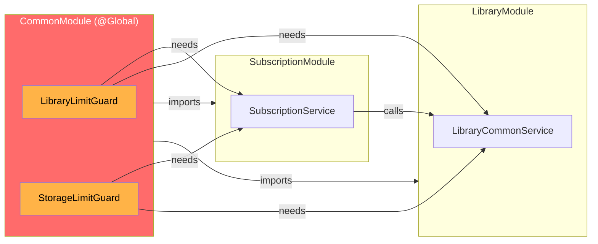
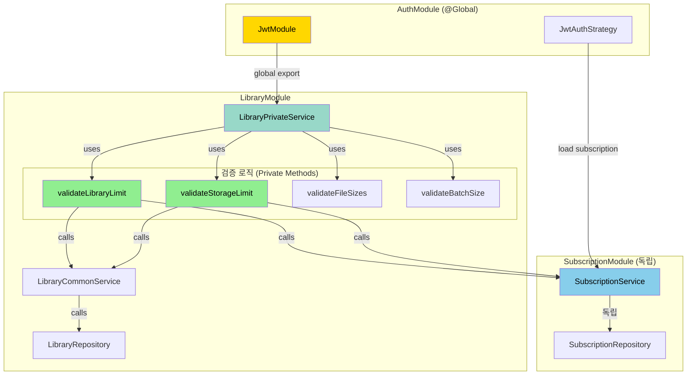

# Module Dependency Architecture

> Subscription, Library, Storage 모듈 간 의존성 관계 및 설계 원칙

## 목차
- [1. 개요](#1-개요)
- [2. 모듈 의존성 그래프](#2-모듈-의존성-그래프)
- [3. 순환 의존성 문제 해결](#3-순환-의존성-문제-해결)
- [4. 모듈별 상세 설명](#4-모듈별-상세-설명)
- [5. 설계 원칙](#5-설계-원칙)

---

## 1. 개요

### 1.1 핵심 모듈

NewLearnNote 백엔드는 다음 핵심 모듈로 구성됩니다:

| 모듈 | 역할 | 의존성 |
|------|------|--------|
| **AuthModule** | 인증/인가, JWT 관리 | @Global, 독립 |
| **SubscriptionModule** | 플랜 정보, 제한 조회 | 독립 |
| **LibraryModule** | 문서 관리, 파일 업로드 | SubscriptionModule |
| **StorageModule** | GCS 파일 저장소 | 독립 |
| **UserModule** | 사용자 정보 관리 | 독립 |

### 1.2 설계 목표

1. **순환 의존성 제거**: 단방향 의존성 유지
2. **책임 분리**: 각 모듈의 역할 명확화
3. **확장성**: 새로운 기능 추가 시 영향 최소화
4. **테스트 용이성**: 모듈별 독립 테스트 가능


## 2. 모듈 의존성 그래프

### 2.1 전체 의존성 구조



### 2.2 핵심 의존성 관계

#### ✅ 올바른 의존성 (단방향)

```
LibraryModule → SubscriptionModule
(라이브러리가 구독 제한 확인)
```

**이유:**
- 라이브러리 생성/업로드 시 플랜 제한 확인 필요
- SubscriptionModule은 Library를 몰라도 됨 (독립성)
- 비즈니스 흐름상 자연스러움

#### ❌ 잘못된 의존성 (제거됨)

```
SubscriptionModule → LibraryModule  (X)
(구독이 라이브러리 데이터 조회 - 책임 역전)
```

**문제점:**
- 도메인 책임 역전
- 순환 의존성 발생 가능
- SubscriptionModule이 Library 내부 구현에 의존

## 3. 순환 의존성 문제 해결

### 3.1 이전 아키텍처 (문제)



**문제점:**
1. **Guards가 비즈니스 로직 수행**
   - DB 조회, 플랜 체크, 제한 검증
   - Guard의 역할 오버로딩

2. **양방향 의존성**
   - SubscriptionModule → LibraryModule (getStorageUsage, getLibraryCount 호출)
   - LibraryModule의 Guards → SubscriptionModule 필요

3. **CommonModule이 비즈니스 모듈 import**
   - @Global 모듈이 비즈니스 모듈에 의존
   - 순환 의존성 위험

### 3.2 개선된 아키텍처 (해결)



**해결책:**
1. **Guard → Service 이동**
   - 비즈니스 규칙 검증은 Service 레이어에서 수행
   - Guard는 인증/인가만 담당

2. **단방향 의존성**
   - LibraryModule → SubscriptionModule (필요한 곳에서 의존)
   - SubscriptionModule은 독립적 (Library를 모름)

3. **JWT에서 Subscription 로딩**
   - JwtAuthStrategy에서 user 조회 시 subscription 포함
   - request.user.subscription으로 접근
   - 추가 DB 조회 불필요

## 4. 모듈별 상세 설명

### 4.1 AuthModule (@Global)

**역할:**
- JWT 기반 인증/인가
- Google OAuth 2.0 로그인
- Refresh Token 관리
- Token Blacklist 관리

**제공:**
```typescript
@Global()
@Module({
  imports: [
    JwtModule.registerAsync({ ... }),
    PassportModule,
    UserModule,
    SubscriptionModule,
  ],
  exports: [AuthService, JwtModule],
})
export class AuthModule {}
```

**핵심 기능:**
- `JwtAuthStrategy.validate()`: user + subscription 조회
- `JwtModule`: 전역으로 export하여 모든 모듈에서 사용 가능

**의존성:**
- SubscriptionModule (FREE 플랜 구독 생성용)
- UserModule (사용자 정보 조회)

### 4.2 SubscriptionModule

**역할:**
- 구독 플랜 정보 관리
- 플랜별 제한 조회
- 바이트 변환 유틸리티

**제공:**
```typescript
@Module({
  imports: [PrismaModule],
  providers: [SubscriptionService, SubscriptionRepository],
  exports: [SubscriptionService],
})
export class SubscriptionModule {}
```

**핵심 메서드:**
```typescript
class SubscriptionService {
  getCurrentPlan(userId): Promise<SubscriptionPlan>
  getStorageLimit(userId): Promise<number>      // 바이트
  getLibraryLimit(userId): Promise<number|null> // FREE: 1, 나머지: null
  formatBytes(bytes): string
}
```

**의존성:**
- PrismaModule만 의존 (완전 독립)

### 4.3 LibraryModule

**역할:**
- 문서 라이브러리 생성/관리
- 파일 업로드/다운로드
- Published/Private 분리 관리
- 용량 제한 검증

**제공:**
```typescript
@Module({
  imports: [
    StorageModule,
    UserModule,
    SubscriptionModule,  // ← 플랜 제한 조회용
  ],
  providers: [
    LibraryPrivateService,
    LibraryCommonService,
    LibraryRepository,
  ],
  exports: [
    LibraryPrivateService,
    LibraryCommonService,
  ],
})
export class LibraryModule {}
```

**핵심 검증 로직:**
```typescript
class LibraryPrivateService {
  // 라이브러리 개수 제한
  private async validateLibraryLimit(userId: string): Promise<void> {
    const currentCount = await this.libraryCommonService.getLibraryCount(userId);
    const limit = await this.subscriptionService.getLibraryLimit(userId);
    // 검증 로직...
  }

  // 총 용량 제한
  private async validateStorageLimit(
    userId: string,
    files: Express.Multer.File[],
  ): Promise<void> {
    const currentUsage = await this.libraryCommonService.getTotalStorageUsage(userId);
    const storageLimit = await this.subscriptionService.getStorageLimit(userId);
    // 검증 로직...
  }

  // 개별 파일 크기 (10MB)
  private validateFileSizes(files): void { ... }

  // 배치 크기 (50MB)
  private validateBatchSize(files): void { ... }
}
```

**의존성:**
- SubscriptionModule (플랜 제한 조회)
- StorageModule (GCS 파일 업로드)
- UserModule (사용자 정보)

### 4.4 StorageModule

**역할:**
- Google Cloud Storage 파일 관리
- 파일 업로드/다운로드/삭제
- 파일 트리 생성
- 폴더 관리

**제공:**
```typescript
@Module({
  providers: [StorageService],
  exports: [StorageService],
})
export class StorageModule {}
```

**핵심 메서드:**
```typescript
class StorageService {
  uploadStream(stream, path): Promise<void>
  deleteFile(path): Promise<void>
  deleteFolder(path): Promise<void>
  getFileSize(path): Promise<number>
  getFileTree(userId, libraryId, status): Promise<FileTree>
}
```

**의존성:**
- 없음 (완전 독립)

## 5. 설계 원칙

### 5.1 단방향 의존성 (Acyclic Dependencies)

```
Infrastructure ← Business ← Application
   (Storage)      (Library)   (Controller)
```

**규칙:**
- 상위 레이어는 하위 레이어에 의존
- 하위 레이어는 상위 레이어를 모름
- 순환 의존성 절대 금지

### 5.2 책임 분리 (Separation of Concerns)

| 레이어 | 책임 | 예시 |
|--------|------|------|
| **Controller** | 요청 라우팅, 파라미터 검증 | `@Get()`, `@Post()` |
| **Guard** | 인증/인가 검증 | `JwtAuthGuard`, `LibraryOwnerGuard` |
| **Service** | 비즈니스 로직, 규칙 검증 | `validateStorageLimit()` |
| **Repository** | 데이터 액세스 | `getTotalStorageUsage()` |

**안티 패턴:**
- ❌ Guard에서 비즈니스 로직 수행
- ❌ Controller에서 직접 DB 접근
- ❌ Repository에서 비즈니스 규칙 검증

### 5.3 의존성 주입 (Dependency Injection)

```typescript
// ✅ 올바른 방법: 생성자 주입
@Injectable()
export class LibraryPrivateService {
  constructor(
    private readonly subscriptionService: SubscriptionService,
    private readonly libraryCommonService: LibraryCommonService,
    private readonly storageService: StorageService,
  ) {}
}

// ❌ 잘못된 방법: 직접 인스턴스 생성
const subscriptionService = new SubscriptionService();
```

### 5.4 인터페이스 분리 (Interface Segregation)

**Service는 필요한 메서드만 노출:**

```typescript
// SubscriptionService (공개 API)
export class SubscriptionService {
  getCurrentPlan(userId): Promise<SubscriptionPlan>  // ← Library에서 사용
  getStorageLimit(userId): Promise<number>           // ← Library에서 사용
  getLibraryLimit(userId): Promise<number|null>      // ← Library에서 사용

  // ❌ Library 관련 메서드 없음 (제거됨)
  // getStorageUsage(userId): Promise<number>        // 삭제
  // getLibraryCount(userId): Promise<number>        // 삭제
}
```

### 5.5 성능 최적화

**JWT 인증 시 Subscription 로딩:**
```typescript
// JwtAuthStrategy.validate() → AuthRepository.findUserBySub()
const user = await this.prisma.user.findFirst({
  where: { id: sub },
  include: {
    subscriptions: {
      where: { status: 'active' },
      include: { plan: true },
      take: 1,
    },
  },
});

// 결과: request.user.subscription 바로 접근 가능
// 추가 DB 조회 불필요
```

## 관련 문서

- [저장 용량 제한 시스템](./STORAGE_LIMIT.md) - 용량 제한 구현 세부사항
- [아키텍처](./ARCHITECTURE.md) - 전체 시스템 아키텍처
- [데이터베이스](./DATABASE.md) - Prisma 스키마, 관계
- [인증/인가](./AUTH_FLOW.md) - JWT, OAuth 2.0
