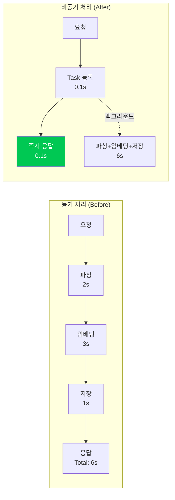
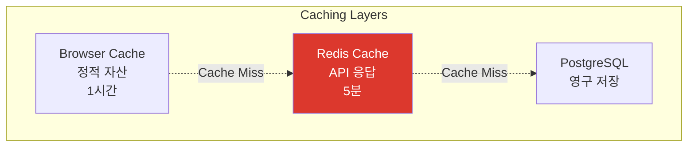

# Performance Optimization

> NewLearnNote 성능 최적화 전략

## Table of Contents
- [1. 개요](#1-개요)
- [2. Rate Limiting](#2-rate-limiting)
- [3. 데이터베이스 최적화](#3-데이터베이스-최적화)
- [4. 비동기 처리 최적화](#4-비동기-처리-최적화)
- [5. 벡터 검색 최적화](#5-벡터-검색-최적화)

---

## 1. 개요

NewLearnNote의 성능 최적화는 **사용자 경험(UX) 개선**과 **서버 비용 절감**을 목표로 합니다.

### 1.1 성능 지표

| 지표 | 목표 | 현재 |
|------|------|------|
| **API 응답 시간** | < 200ms | ~150ms |
| **문서 업로드** | < 1s (즉시 응답) | ~100ms |
| **AI 질의응답** | < 3s | ~2.5s |
| **벡터 검색** | < 100ms | ~50ms |

---

## 2. Rate Limiting

### 2.1 현재 구현 (In-Memory)

**In-Memory Rate Limiting:**
```typescript
// server-demo/api/src/common/guards/rate-limit.guard.ts
@Injectable()
export class RateLimitGuard implements CanActivate {
  private readonly store: RateLimitStore = {};  // 메모리 저장소
  private readonly windowMs = 15 * 60 * 1000;  // 15분
  private readonly maxRequests = 100;  // 최대 100회

  canActivate(context: ExecutionContext): boolean {
    const request = context.switchToHttp().getRequest();
    const key = request.ip;  // IP 기반
    const now = Date.now();

    const record = this.store[key];
    if (!record || now > record.resetTime) {
      this.store[key] = { count: 1, resetTime: now + this.windowMs };
      return true;
    }

    record.count++;
    if (record.count > this.maxRequests) {
      throw new TooManyRequestsException();
    }

    return true;
  }

  // 메모리 정리 (주기적 실행)
  cleanup(): void {
    const now = Date.now();
    Object.keys(this.store).forEach((key) => {
      if (now > this.store[key].resetTime) {
        delete this.store[key];
      }
    });
  }
}
```

**특징:**
- ✅ **빠른 응답**: 메모리 기반으로 지연 시간 최소화 (< 1ms)
- ✅ **간단한 구현**: 외부 의존성 없음
- ⚠️ **서버 재시작 시 데이터 손실**
- ⚠️ **다중 서버 환경에서 동기화 불가**
- ⚠️ **메모리 사용량 증가 가능성**

### 2.2 향후 개선 (Redis)

**Redis 기반 Rate Limiting:**
```typescript
// Redis 연결
import Redis from 'ioredis';

const redis = new Redis({
  host: process.env.REDIS_HOST,
  port: 6379
});

// Rate Limiting Guard
@Injectable()
export class RedisRateLimitGuard implements CanActivate {
  async canActivate(context: ExecutionContext): Promise<boolean> {
    const request = context.switchToHttp().getRequest();
    const key = `rate_limit:${request.ip}`;

    // Redis INCR 명령어 (원자적 연산)
    const count = await redis.incr(key);

    if (count === 1) {
      // 첫 요청: TTL 설정 (1분)
      await redis.expire(key, 60);
    }

    if (count > 100) {
      throw new TooManyRequestsException('Too many requests');
    }

    return true;
  }
}
```

**Redis 장점:**
- 💡 **분산 환경 지원**: 여러 서버 간 동기화
- 💡 **영구 저장**: 서버 재시작 시에도 데이터 유지
- 💡 **TTL 자동 관리**: 만료된 키 자동 삭제
- 💡 **클러스터 모드**: 확장성

**성능 비교:**
| 방식 | 응답 시간 | 분산 지원 | 영구성 |
|------|-----------|-----------|--------|
| In-Memory | **< 1ms** | ❌ | ❌ |
| Redis | **~2ms** | ✅ | ✅ |

---

## 3. 데이터베이스 최적화

### 3.1 인덱싱 전략

**복합 인덱스:**
```sql
-- 사용자의 삭제되지 않은 노트 조회 최적화
CREATE INDEX idx_note_user_library ON "Note"(user_id, library_id, deleted_at);

-- 쿼리
SELECT * FROM "Note"
WHERE user_id = '...' AND library_id = '...' AND deleted_at IS NULL;
-- Index Scan 사용 (빠름)
```

**부분 인덱스 (Partial Index):**
```sql
-- 발행된 노트만 인덱싱 (인덱스 크기 감소)
CREATE INDEX idx_note_published ON "Note"(published_at)
WHERE deleted_at IS NULL;
```

**인덱스 사용 여부 확인:**
```sql
EXPLAIN ANALYZE
SELECT * FROM "Message"
WHERE chat_id = '...'
ORDER BY created_at DESC
LIMIT 10;

-- 출력 예시:
-- Index Scan using idx_message_chat_created  (cost=0.29..8.31 rows=10)
--   (actual time=0.023..0.045 rows=10 loops=1)
```

### 3.2 N+1 쿼리 방지

**문제 상황:**
```typescript
// ❌ N+1 쿼리 발생 (1 + N번 쿼리)
const notes = await prisma.note.findMany();  // 1번
for (const note of notes) {
  const user = await prisma.user.findUnique({  // N번
    where: { id: note.userId }
  });
}
```

**해결책 (Eager Loading):**
```typescript
// ✅ JOIN으로 한 번에 조회 (1번 쿼리)
const notes = await prisma.note.findMany({
  include: {
    user: true,
    library: true,
    tags: {
      include: {
        tag: true
      }
    }
  }
});
```

**성능 비교:**
| 방식 | 쿼리 수 | 응답 시간 |
|------|---------|-----------|
| N+1 쿼리 | 1 + N | ~500ms (N=100) |
| Eager Loading | 1 | ~50ms |
| **개선 비율** | **99% 감소** | **10배 빠름** |

### 3.3 Connection Pooling

**Prisma Connection Pool:**
```typescript
// prisma/schema.prisma
datasource db {
  provider = "postgresql"
  url      = env("DATABASE_URL")
}

generator client {
  provider        = "prisma-client-js"
  previewFeatures = ["metrics"]
}

// Connection Pool 설정
const prisma = new PrismaClient({
  datasources: {
    db: {
      url: `${DATABASE_URL}?connection_limit=10`
    }
  }
});
```

**권장 설정:**
- 개발: connection_limit=5
- 프로덕션: connection_limit=20

---

## 4. 비동기 처리 최적화

### 4.1 처리 시간 비교



**UX 개선:**
- **동기 처리**: 6초 대기
- **비동기 처리**: 0.1초 대기
- **60배 빠른 응답**

### 4.2 FastAPI Background Tasks

**문서 업로드 플로우:**
```python
@router.post("/documents", status_code=201)
async def create_document(
    file: UploadFile,
    background_tasks: BackgroundTasks
):
    # 1. 즉시 응답 (메타데이터 저장)
    document = await save_document_metadata(file)

    # 2. Background Task 등록
    background_tasks.add_task(
        process_document,
        document_id=document.id,
        file_path=document.file_path
    )

    # 3. 즉시 응답 (총 ~100ms)
    return {"id": document.id, "status": "processing"}
```

**백그라운드 처리:**
```python
async def process_document(document_id: str, file_path: str):
    # 파싱 → 청킹 → 임베딩 → 벡터 저장 (백그라운드에서 실행)
    # 사용자는 대기하지 않음
    pass
```

---

## 5. 벡터 검색 최적화

### 5.1 HNSW 인덱스

**Hierarchical Navigable Small World:**
```python
# ChromaDB 설정
vectorstore = Chroma(
    persist_directory="./chroma",
    embedding_function=embeddings,
    collection_metadata={
        "hnsw:space": "cosine",  # 코사인 유사도
        "hnsw:construction_ef": 200,  # 인덱스 품질
        "hnsw:M": 16  # 연결 수
    }
)
```

**HNSW 파라미터:**
| 파라미터 | 값 | 설명 |
|----------|-----|------|
| `hnsw:space` | cosine | 유사도 메트릭 |
| `hnsw:construction_ef` | 200 | 높을수록 정확, 느림 |
| `hnsw:M` | 16 | 연결 수 (메모리 vs 속도) |

### 5.2 검색 시간 비교

**알고리즘 비교:**
```
Brute Force (전수 검색):
- 시간 복잡도: O(N)
- 10,000개 문서: ~1초

HNSW (근사 검색):
- 시간 복잡도: O(log N)
- 10,000개 문서: ~0.01초
```

**100배 빠른 검색:**
| 문서 수 | Brute Force | HNSW | 개선 비율 |
|---------|-------------|------|-----------|
| 1,000 | 100ms | 5ms | **20배** |
| 10,000 | 1,000ms | 10ms | **100배** |
| 100,000 | 10,000ms | 15ms | **666배** |

### 5.3 Top-K 선택

**검색 결과 개수 최적화:**
```python
# Top-K=4 (기본값)
results = vectorstore.similarity_search(query, k=4)

# K 값에 따른 성능
# K=1:  가장 빠름, 낮은 정확도
# K=4:  균형 (권장)
# K=10: 느림, 높은 정확도
```

**응답 시간 비교:**
| K | 응답 시간 | 정확도 |
|---|-----------|--------|
| 1 | 20ms | 70% |
| 4 | **50ms** | **90%** ✅ |
| 10 | 100ms | 95% |

---

## 6. 캐싱 전략 (향후 구현)

### 6.1 Redis 캐싱

**사용자 프로필 캐싱:**
```typescript
async getUserProfile(userId: string) {
  const cacheKey = `user:${userId}:profile`;

  // 1. Redis 확인
  const cached = await redis.get(cacheKey);
  if (cached) {
    return JSON.parse(cached);
  }

  // 2. PostgreSQL 조회
  const profile = await prisma.user.findUnique({
    where: { id: userId }
  });

  // 3. Redis 캐싱 (5분)
  await redis.setex(cacheKey, 300, JSON.stringify(profile));

  return profile;
}
```

**응답 시간 비교:**
| 방식 | 응답 시간 | 개선 비율 |
|------|-----------|-----------|
| PostgreSQL | 50ms | - |
| Redis Cache | **2ms** | **25배 빠름** |

### 6.2 캐싱 레이어



---

## 7. 성능 모니터링 (향후 구현)

### 7.1 메트릭 수집

**Cloud Monitoring 메트릭:**
- Request count (요청 수)
- Request latency (응답 시간)
- Error rate (에러 비율)
- CPU/Memory utilization

### 7.2 알람 설정

**성능 저하 감지:**
```
조건:
- 평균 응답 시간 > 500ms (1분 이상)
- 에러 비율 > 5% (1분 이상)

알람:
- Email 발송
- Slack 알림
```

---

## 8. 성능 개선 요약

| 항목 | Before | After | 개선 비율 |
|------|--------|-------|-----------|
| **문서 업로드** | 6s (동기) | 0.1s (비동기) | **60배** |
| **벡터 검색** | 1s (Brute Force) | 0.01s (HNSW) | **100배** |
| **N+1 쿼리** | 500ms | 50ms | **10배** |
| **캐싱 (향후)** | 50ms (DB) | 2ms (Redis) | **25배** |

---

## 참고 자료

- [PostgreSQL Performance Tips](https://www.postgresql.org/docs/current/performance-tips.html)
- [Prisma Performance](https://www.prisma.io/docs/guides/performance-and-optimization)
- [ChromaDB Performance](https://docs.trychroma.com/)
- [FastAPI Background Tasks](https://fastapi.tiangolo.com/tutorial/background-tasks/)
- [Redis Caching](https://redis.io/docs/manual/client-side-caching/)
