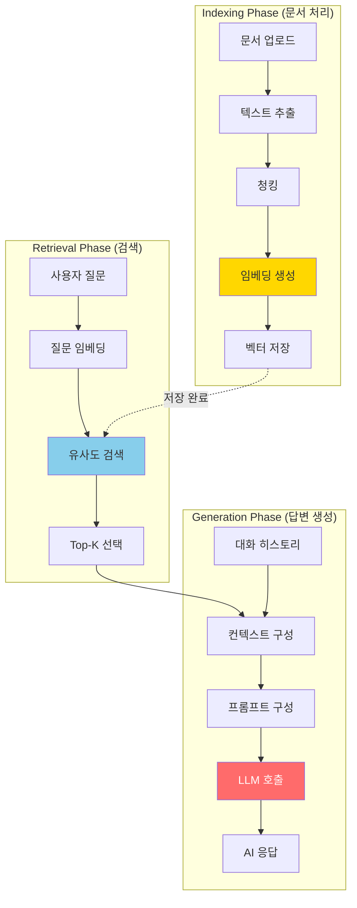
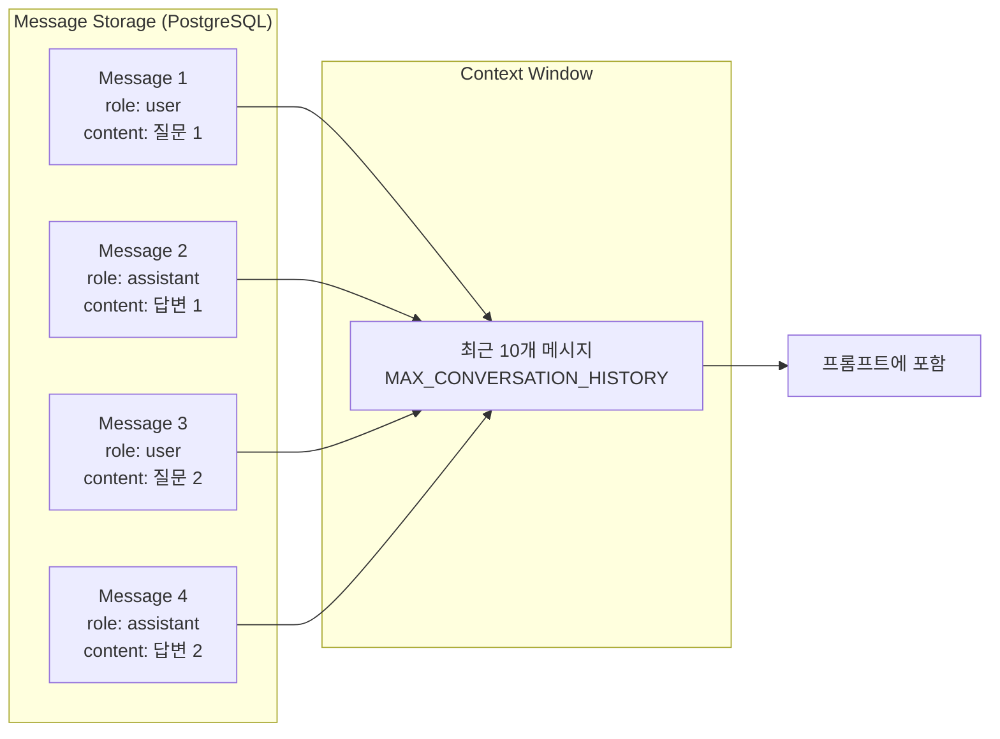

# RAG Pipeline

> Retrieval-Augmented Generation 파이프라인 상세 설명

## Table of Contents
- [1. RAG 개요](#1-rag-개요)
- [2. Indexing Phase (문서 처리)](#2-indexing-phase-문서-처리)
- [3. Retrieval Phase (검색)](#3-retrieval-phase-검색)
- [4. Generation Phase (답변 생성)](#4-generation-phase-답변-생성)
- [5. 대화 히스토리 관리](#5-대화-히스토리-관리)

---

## 1. RAG 개요

### 1.1 RAG란?

**Retrieval-Augmented Generation:**
- **Retrieval**: 관련 문서 검색
- **Augmented**: 검색 결과로 컨텍스트 강화
- **Generation**: LLM이 컨텍스트 기반 답변 생성

### 1.2 전체 파이프라인



---

## 2. Indexing Phase (문서 처리)

### 2.1 문서 처리 플로우

```python
# app/services/rag_service.py

async def add_document_to_vectorstore(
    document_id: str,
    text: str,
    metadata: dict
) -> int:
    """
    문서를 벡터스토어에 추가

    Steps:
    1. 텍스트 청킹
    2. 임베딩 생성
    3. ChromaDB 저장
    """

    # 1. 텍스트 청킹
    chunks = RAGService.split_text(text)

    # 2. Langchain Document 객체 생성
    from langchain.schema import Document as LangchainDocument

    documents = [
        LangchainDocument(
            page_content=chunk,
            metadata={
                **metadata,
                "document_id": document_id,
                "chunk_index": i
            }
        )
        for i, chunk in enumerate(chunks)
    ]

    # 3. 임베딩 생성 + ChromaDB 저장
    vectorstore = RAGService.get_vectorstore()
    vectorstore.add_documents(documents)

    return len(chunks)
```

### 2.2 텍스트 청킹

**RecursiveCharacterTextSplitter:**
```python
from langchain.text_splitters import RecursiveCharacterTextSplitter

@staticmethod
def split_text(text: str) -> list[str]:
    """
    텍스트를 청크로 분할

    Parameters:
    - chunk_size: 1000자
    - chunk_overlap: 200자
    - separators: 단락 → 문장 → 단어 순
    """

    text_splitter = RecursiveCharacterTextSplitter(
        chunk_size=1000,
        chunk_overlap=200,
        length_function=len,
        separators=["\n\n", "\n", " ", ""]
    )

    chunks = text_splitter.split_text(text)
    return chunks
```

**청킹 예시:**
```
원본:
"머신러닝(Machine Learning)은 인공지능의 한 분야입니다.

머신러닝은 데이터로부터 학습하여 예측을 수행합니다."

↓ 청킹 ↓

청크 1:
"머신러닝(Machine Learning)은 인공지능의 한 분야입니다."

청크 2:
"머신러닝은 데이터로부터 학습하여 예측을 수행합니다."
```

### 2.3 임베딩 생성

**OpenAI text-embedding-3-small:**
```python
from langchain_openai import OpenAIEmbeddings

embeddings = OpenAIEmbeddings(
    openai_api_key=settings.OPENAI_API_KEY,
    model="text-embedding-3-small"  # 1536-dim vector
)

# 청크 임베딩
chunk_embeddings = embeddings.embed_documents(chunks)
```

**임베딩 벡터 예시:**
```python
[
    [0.123, -0.456, 0.789, ...],  # 1536-dim
    [0.234, -0.567, 0.890, ...],
    ...
]
```

### 2.4 ChromaDB 저장

**벡터 저장:**
```python
vectorstore = Chroma(
    persist_directory="./chroma",
    embedding_function=embeddings,
    collection_name="documents"
)

# 문서 추가
vectorstore.add_documents([
    {
        "page_content": chunk,
        "metadata": {
            "document_id": "uuid-xxx",
            "filename": "ML_notes.pdf",
            "chunk_index": 0
        }
    }
    for chunk in chunks
])
```

---

## 3. Retrieval Phase (검색)

### 3.1 유사도 검색

**코사인 유사도 기반 검색:**
```python
async def search_similar_chunks(
    query: str,
    document_ids: Optional[list[str]] = None,
    k: int = 4
) -> list[dict]:
    """
    유사한 청크 검색

    Parameters:
    - query: 사용자 질문
    - document_ids: 검색할 문서 ID 리스트 (None이면 전체)
    - k: 반환할 결과 개수 (Top-K)
    """

    vectorstore = RAGService.get_vectorstore()

    # 문서 ID 필터링
    if document_ids:
        results = vectorstore.similarity_search(
            query,
            k=k,
            filter={"document_id": {"$in": document_ids}}
        )
    else:
        results = vectorstore.similarity_search(query, k=k)

    # 결과를 딕셔너리로 변환
    return [
        {
            "content": doc.page_content,
            "metadata": doc.metadata,
            "similarity": doc.metadata.get("score", 0)
        }
        for doc in results
    ]
```

**검색 과정:**
```
1. 질문 임베딩 생성
   "머신러닝이란?" → [0.345, -0.678, ...]

2. 코사인 유사도 계산
   similarity(query_vector, chunk_vector) = cosine(v1, v2)

3. Top-K 선택
   가장 유사한 4개 청크 반환
```

### 3.2 검색 결과 예시

```python
[
    {
        "content": "머신러닝(Machine Learning)은 인공지능의 한 분야입니다.",
        "metadata": {
            "document_id": "uuid-123",
            "filename": "ML_intro.pdf",
            "chunk_index": 0
        },
        "similarity": 0.92
    },
    {
        "content": "머신러닝은 데이터로부터 학습하여 예측을 수행합니다.",
        "metadata": {
            "document_id": "uuid-123",
            "filename": "ML_intro.pdf",
            "chunk_index": 1
        },
        "similarity": 0.88
    },
    ...
]
```

---

## 4. Generation Phase (답변 생성)

### 4.1 RAG 기반 응답 생성

```python
async def generate_response(
    query: str,
    context_chunks: list[dict],
    conversation_history: list[dict] = None
) -> str:
    """
    RAG 기반 응답 생성

    Parameters:
    - query: 사용자 질문
    - context_chunks: 검색된 문서 청크
    - conversation_history: 이전 대화 (최근 10개)
    """

    llm = ChatOpenAI(
        model="gpt-4o-mini",
        temperature=0.0,  # 일관된 답변
        max_tokens=1000
    )

    # 1. 대화 히스토리 포맷팅
    history_text = ""
    if conversation_history:
        history_text = "\n\n이전 대화 내용:\n"
        for msg in conversation_history:
            role_name = "사용자" if msg["role"] == "user" else "어시스턴트"
            content = msg["content"]
            if len(content) > 500:
                content = content[:500] + "..."
            history_text += f"{role_name}: {content}\n"

    # 2. 컨텍스트 구성
    if context_chunks:
        context = "\n\n".join([
            f"[문서: {chunk['metadata']['filename']}]\n{chunk['content']}"
            for chunk in context_chunks
        ])

        # 3. 프롬프트 구성 (문서 기반)
        prompt = f"""당신은 친절한 AI 어시스턴트입니다. 사용자가 업로드한 문서 내용을 참고하여 답변할 수 있습니다.
{history_text}

참고 문서 내용:

{context}

사용자 질문: {query}

답변 시 주의사항:
1. 위 대화 히스토리를 참고하여 맥락을 이해하세요.
2. 문서 내용이 질문과 관련이 있다면 우선적으로 참고하여 답변하세요.
3. 문서 내용을 사용했다면 어떤 문서를 참고했는지 간단히 언급하세요.
4. 문서 내용이 질문과 관련이 없다면, 일반 지식을 바탕으로 친절하게 답변하세요.
5. 한국어로 답변하세요.

답변:"""
    else:
        # 4. 프롬프트 구성 (일반 대화)
        prompt = f"""당신은 친절한 AI 어시스턴트입니다.
{history_text}

사용자 질문: {query}

답변 시 주의사항:
1. 위 대화 히스토리를 참고하여 맥락을 이해하세요.
2. 친절하고 정확하게 답변하세요.
3. 한국어로 답변하세요.
4. 모르는 내용은 모른다고 솔직히 말하세요.

답변:"""

    # 5. LLM 호출
    response = await llm.ainvoke(prompt)
    return response.content
```

### 4.2 프롬프트 엔지니어링

**효과적인 프롬프트 구조:**
```
1. 역할 정의
   "당신은 친절한 AI 어시스턴트입니다."

2. 컨텍스트 제공
   - 대화 히스토리
   - 문서 내용

3. 질문 명시
   "사용자 질문: ..."

4. 지침 제공
   - 문서 우선 참고
   - 한국어 답변
   - 출처 명시

5. 답변 유도
   "답변:"
```

### 4.3 LLM 설정

**GPT-4o-mini 파라미터:**
```python
ChatOpenAI(
    model="gpt-4o-mini",
    temperature=0.0,  # 일관성 (0: 결정적, 1: 창의적)
    max_tokens=1000,  # 최대 토큰 수
    openai_api_key=settings.OPENAI_API_KEY
)
```

**Temperature 비교:**
- **0.0**: 같은 질문에 항상 같은 답변 (일관성)
- **0.7**: 약간의 변화 (균형)
- **1.0**: 매번 다른 답변 (창의성)

---

## 5. 대화 히스토리 관리

### 5.1 히스토리 구조



### 5.2 대화 히스토리 조회

```python
async def get_conversation_history(
    chat_id: str,
    limit: int = 10
) -> list[dict]:
    """
    최근 대화 히스토리 조회

    Parameters:
    - chat_id: 채팅방 ID
    - limit: 메시지 개수 (기본 10개)
    """

    async with get_db() as db:
        result = await db.execute(
            select(Message)
            .where(Message.chat_id == chat_id)
            .order_by(Message.created_at.desc())
            .limit(limit)
        )
        messages = result.scalars().all()

    # 오래된 순으로 정렬
    messages.reverse()

    return [
        {
            "role": msg.role,
            "content": msg.content
        }
        for msg in messages
    ]
```

### 5.3 토큰 제한 관리

**최대 토큰 제한:**
- GPT-4o-mini: **128,000 토큰** (입력 + 출력)
- 영문: ~4자 = 1토큰
- 한글: ~1자 = 1토큰

**토큰 절약 전략:**
```python
# 긴 메시지 요약
if len(content) > 500:
    content = content[:500] + "..."

# 최근 10개 메시지만 포함
conversation_history = get_conversation_history(chat_id, limit=10)
```

---

## 6. 문서 삭제 (벡터스토어)

### 6.1 벡터 삭제

```python
async def delete_document_from_vectorstore(document_id: str):
    """
    벡터스토어에서 문서 삭제

    - document_id로 필터링하여 모든 청크 삭제
    """

    vectorstore = RAGService.get_vectorstore()

    # ChromaDB에서 삭제
    vectorstore.delete(
        filter={"document_id": document_id}
    )

    print(f"✅ Document {document_id} deleted from vectorstore")
```

---

## 7. RAG 평가 지표 (향후 개선)

### 7.1 검색 품질

**Metrics:**
- **Precision@K**: Top-K 중 관련 문서 비율
- **Recall@K**: 전체 관련 문서 중 검색된 비율
- **MRR (Mean Reciprocal Rank)**: 첫 관련 문서 순위

### 7.2 답변 품질

**Metrics:**
- **Faithfulness**: 문서 내용 기반 답변 비율
- **Answer Relevance**: 질문과 답변 관련성
- **Context Relevance**: 검색된 문서와 질문 관련성

---

## 참고 자료

- [LangChain Documentation](https://python.langchain.com/docs/get_started/introduction)
- [OpenAI Embeddings](https://platform.openai.com/docs/guides/embeddings)
- [ChromaDB Documentation](https://docs.trychroma.com/)
- [RAG Paper (Lewis et al., 2020)](https://arxiv.org/abs/2005.11401)
