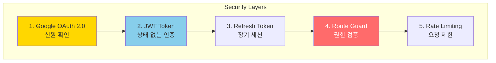
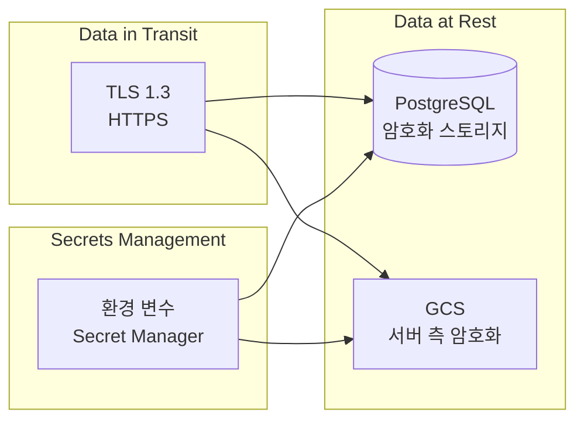

# Security Architecture

> NewLearnNote 보안 아키텍처 및 전략

## Table of Contents
- [1. 보안 개요](#1-보안-개요)
- [2. 인증/인가 보안](#2-인증인가-보안)
- [3. 데이터 보안](#3-데이터-보안)
- [4. API 보안](#4-api-보안)
- [5. 파일 보안](#5-파일-보안)

---

## 1. 보안 개요

### 1.1 보안 계층



### 1.2 보안 원칙

| 원칙 | 구현 |
|------|------|
| **최소 권한** | 사용자별 권한 검증 (Guard) |
| **심층 방어** | 다층 보안 (OAuth → JWT → Guard) |
| **암호화** | TLS 1.3 (통신), AES (저장) |
| **감사 추적** | 로깅, Soft Delete |

---

## 2. 인증/인가 보안

### 2.1 OAuth 2.0 보안

**Google OAuth 신뢰:**
- ✅ Google이 신원 확인
- ✅ 비밀번호 저장 불필요
- ✅ 2FA (Two-Factor Authentication) 지원

**Authorization Code Flow:**
```
1. 클라이언트 → Google: 로그인 요청
2. Google → 사용자: 로그인 페이지
3. 사용자 → Google: 로그인 완료
4. Google → 클라이언트: Authorization Code
5. 클라이언트 → Google: Code 교환
6. Google → 클라이언트: User Profile
```

**보안 고려사항:**
- Authorization Code는 1회용 (재사용 불가)
- HTTPS 필수
- State 파라미터로 CSRF 방지

### 2.2 JWT 보안

**Access Token:**
```typescript
// 토큰 생성
const payload = {
  sub: user.id,
  email: user.email,
  iat: Math.floor(Date.now() / 1000),  // 발행 시간
  exp: Math.floor(Date.now() / 1000) + 15 * 60  // 만료 시간 (15분)
};

const token = jwt.sign(payload, process.env.JWT_SECRET, {
  algorithm: 'HS256'
});
```

**보안 전략:**
- ✅ **짧은 수명**: 15분 (탈취 시 피해 최소화)
- ✅ **서버 측 검증**: JWT 서명 검증
- ✅ **HTTPS Only**: 토큰 전송 시 암호화
- ✅ **localStorage 금지**: XSS 공격 방지

### 2.3 Refresh Token 보안

**재사용 방지:**
```typescript
// 토큰 갱신 시 기존 토큰 무효화
await prisma.refreshToken.update({
  where: { id: oldToken.id },
  data: { revokedAt: new Date() }
});
```

**재사용 감지:**
```typescript
// 무효화된 토큰 사용 시 모든 토큰 무효화
if (token.revokedAt) {
  await prisma.refreshToken.updateMany({
    where: { userId: token.userId },
    data: { revokedAt: new Date() }
  });
  throw new UnauthorizedException('Token reuse detected');
}
```

---

## 3. 데이터 보안

### 3.1 암호화



**통신 암호화 (TLS 1.3):**
```typescript
// NestJS (HTTPS)
const app = await NestFactory.create(AppModule, {
  httpsOptions: {
    key: fs.readFileSync('./secrets/private-key.pem'),
    cert: fs.readFileSync('./secrets/public-certificate.pem')
  }
});
```

**저장 암호화:**
- PostgreSQL: 암호화된 스토리지 (Cloud SQL)
- GCS: 서버 측 암호화 (AES-256)
- 환경 변수: Secret Manager

### 3.2 비밀번호 해싱

**bcrypt 사용:**
```typescript
import * as bcrypt from 'bcrypt';

// 해싱 (회원가입)
const saltRounds = 10;
const hashedPassword = await bcrypt.hash(password, saltRounds);

// 검증 (로그인)
const isMatch = await bcrypt.compare(password, hashedPassword);
```

**bcrypt 특징:**
- ✅ Salt 자동 생성
- ✅ 느린 알고리즘 (무차별 대입 방지)
- ✅ Adaptive (saltRounds 조정 가능)

### 3.3 Secrets 관리

**Google Secret Manager:**
```bash
# Secret 생성
gcloud secrets create openai-api-key \
  --data-file=- <<< "sk-xxx"

# Cloud Run에서 사용
gcloud run deploy nestjs-api \
  --update-secrets OPENAI_API_KEY=openai-api-key:latest
```

**환경별 분리:**
```
Development:
- .env.development (로컬 파일)

Production:
- Secret Manager (클라우드)
```

---

## 4. API 보안

### 4.1 Rate Limiting

**In-Memory Rate Limiting (현재 구현):**
```typescript
@Injectable()
export class RateLimitGuard implements CanActivate {
  private readonly store: RateLimitStore = {};
  private readonly windowMs = 15 * 60 * 1000;  // 15분
  private readonly maxRequests = 100;  // 최대 100회

  canActivate(context: ExecutionContext): boolean {
    const request = context.switchToHttp().getRequest();
    const key = request.ip;  // IP 기반
    const now = Date.now();

    const record = this.store[key];
    if (!record || now > record.resetTime) {
      this.store[key] = { count: 1, resetTime: now + this.windowMs };
      return true;
    }

    record.count++;
    if (record.count > this.maxRequests) {
      throw new TooManyRequestsException('Too many requests');
    }

    return true;
  }
}
```

**제한사항:**
- ⚠️ 서버 재시작 시 데이터 손실
- ⚠️ 다중 서버 환경 미지원

**향후 개선 (Redis):**
```typescript
// Redis 기반 Rate Limiting
const count = await redis.incr(`rate_limit:${ip}`);
if (count === 1) {
  await redis.expire(`rate_limit:${ip}`, 60);
}

if (count > 100) {
  throw new TooManyRequestsException();
}
```

### 4.2 CORS 설정

**NestJS:**
```typescript
app.enableCors({
  origin: true,  // 모든 origin 허용 (개발 환경)
  // origin: ['https://newlearnnote.com'],  // 프로덕션
  methods: ['GET', 'POST', 'PUT', 'DELETE', 'OPTIONS', 'PATCH'],
  allowedHeaders: ['Content-Type', 'Authorization', 'X-Refresh-Token'],
  credentials: true  // Cookie 허용
});
```

**FastAPI:**
```python
from fastapi.middleware.cors import CORSMiddleware

app.add_middleware(
    CORSMiddleware,
    allow_origins=settings.allowed_origins_list,
    allow_credentials=True,
    allow_methods=["*"],
    allow_headers=["*"]
)
```

### 4.3 Input Validation

**NestJS (class-validator):**
```typescript
import { IsEmail, IsString, MinLength } from 'class-validator';

export class SignUpDto {
  @IsEmail()
  email: string;

  @IsString()
  @MinLength(8)
  password: string;
}
```

**FastAPI (Pydantic):**
```python
from pydantic import BaseModel, EmailStr, constr

class SignUpRequest(BaseModel):
    email: EmailStr
    password: constr(min_length=8)
```

### 4.4 XSS 방지

**헬멧 (Helmet) 사용:**
```typescript
import helmet from 'helmet';

app.use(helmet({
  contentSecurityPolicy: {
    directives: {
      defaultSrc: ["'self'"],
      scriptSrc: ["'self'", "'unsafe-inline'"],
      styleSrc: ["'self'", "'unsafe-inline'"]
    }
  }
}));
```

**출력 이스케이핑:**
```typescript
// HTML 특수문자 이스케이프
function escapeHtml(text: string): string {
  return text
    .replace(/&/g, '&amp;')
    .replace(/</g, '&lt;')
    .replace(/>/g, '&gt;')
    .replace(/"/g, '&quot;')
    .replace(/'/g, '&#039;');
}
```

### 4.5 SQL Injection 방지

**Prisma (Parameterized Queries):**
```typescript
// ✅ 안전 (Prisma)
const user = await prisma.user.findUnique({
  where: { email: userInput }
});

// ❌ 위험 (Raw SQL)
const user = await prisma.$queryRaw`
  SELECT * FROM User WHERE email = ${userInput}
`;  // Prisma는 자동으로 파라미터화
```

---

## 5. 파일 보안

### 5.1 파일 업로드 검증

**파일 타입 검증:**
```typescript
const ALLOWED_TYPES = {
  'application/pdf': 'pdf',
  'text/markdown': 'md',
  'text/plain': 'txt',
  'image/jpeg': 'jpg',
  'image/png': 'png'
};

if (!ALLOWED_TYPES[file.mimetype]) {
  throw new BadRequestException('Unsupported file type');
}
```

**파일 크기 제한:**
```typescript
const MAX_FILE_SIZE = 50 * 1024 * 1024;  // 50MB

if (file.size > MAX_FILE_SIZE) {
  throw new BadRequestException('File too large');
}
```

**파일 내용 검증:**
```typescript
// Magic Number 검증 (PDF)
const buffer = file.buffer;
const isPDF = buffer.toString('hex', 0, 4) === '25504446';  // %PDF

if (!isPDF) {
  throw new BadRequestException('Invalid PDF file');
}
```

### 5.2 Signed URL 보안

**시간 제한 URL:**
```typescript
const [signedUrl] = await file.getSignedUrl({
  action: 'read',
  expires: Date.now() + 5 * 60 * 1000  // 5분
});
```

**보안 특징:**
- ✅ **짧은 유효 시간**: 5분 (탈취 위험 감소)
- ✅ **서명 검증**: GCS가 자동 검증
- ✅ **변조 불가**: URL 변경 시 서명 무효화

### 5.3 LibraryOwnerGuard

```typescript
@Injectable()
export class LibraryOwnerGuard implements CanActivate {
  async canActivate(context: ExecutionContext): Promise<boolean> {
    const request = context.switchToHttp().getRequest();
    const user = request.user;
    const libraryId = request.params.id;

    const library = await this.prisma.library.findUnique({
      where: { id: libraryId }
    });

    if (!library) {
      throw new NotFoundException('Library not found');
    }

    if (library.userId !== user.id) {
      throw new ForbiddenException('권한이 없습니다.');
    }

    return true;
  }
}
```

---

## 6. 보안 체크리스트

### 6.1 인증/인가

- [x] Google OAuth 2.0 사용
- [x] JWT Access Token (15분)
- [x] Refresh Token Rotation
- [x] httpOnly Cookie (Web)
- [x] Route Guard (권한 검증)

### 6.2 데이터 보안

- [x] TLS 1.3 (HTTPS)
- [x] PostgreSQL 암호화 스토리지
- [x] GCS 서버 측 암호화
- [x] Secret Manager (환경 변수)
- [x] bcrypt (비밀번호 해싱)

### 6.3 API 보안

- [x] Rate Limiting (In-Memory)
- [ ] Rate Limiting (Redis) - 향후 구현
- [x] CORS 설정
- [x] Input Validation (class-validator, Pydantic)
- [x] Helmet (XSS 방지)
- [x] Prisma (SQL Injection 방지)

### 6.4 파일 보안

- [x] 파일 타입 검증
- [x] 파일 크기 제한
- [x] Signed URL (시간 제한)
- [x] LibraryOwnerGuard (권한 검증)

---

## 7. 보안 모니터링 (향후 구현)

### 7.1 로그 수집

**보안 이벤트 로깅:**
```typescript
// 로그인 실패
logger.warn('Login failed', {
  email: email,
  ip: request.ip,
  timestamp: new Date()
});

// 권한 없음
logger.error('Unauthorized access attempt', {
  userId: user.id,
  resource: libraryId,
  ip: request.ip
});
```

### 7.2 알람 설정

**Cloud Monitoring Alerts:**
- 로그인 실패 5회 이상 (1분 내)
- Rate Limit 초과 10회 이상
- 권한 없음 에러 증가

---

## 참고 자료

- [OWASP Top 10](https://owasp.org/www-project-top-ten/)
- [JWT Best Practices](https://tools.ietf.org/html/rfc8725)
- [Google OAuth 2.0](https://developers.google.com/identity/protocols/oauth2)
- [bcrypt](https://www.npmjs.com/package/bcrypt)
