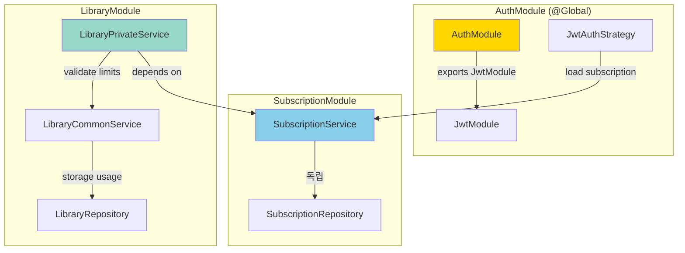
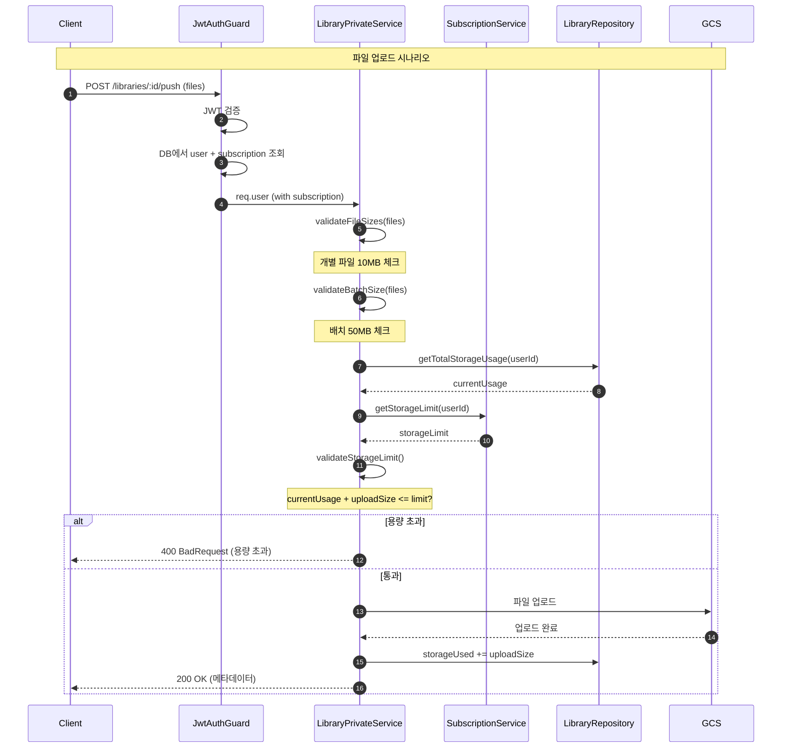

# Storage Limit System

> 플랜별 저장 용량 제한 시스템 설계 및 구현

## 목차
- [1. 개요](#1-개요)
- [2. 제한 정책](#2-제한-정책)
- [3. 아키텍처](#3-아키텍처)
- [4. 구현 세부사항](#4-구현-세부사항)
- [5. 용량 추적](#5-용량-추적)
- [6. 에러 처리](#6-에러-처리)

---

## 1. 개요

### 1.1 목적

NewLearnNote는 플랜별로 차별화된 저장 용량을 제공하여:
- **무료 플랜**: 기본 학습 기능 제공 (1개 라이브러리, 500MB)
- **유료 플랜**: 무제한 라이브러리, 대용량 문서 관리 (5GB~10GB)

### 1.2 설계 원칙

1. **Service 레이어 검증**: Guards 대신 Service에서 비즈니스 규칙 검증
2. **단방향 의존성**: LibraryModule → SubscriptionModule
3. **명확한 에러 메시지**: 사용자에게 현재 상태 및 업그레이드 안내
4. **성능**: JWT 인증 시 subscription 정보 포함하여 추가 DB 조회 불필요

---

## 2. 제한 정책

### 2.1 공통 제한 (모든 플랜)

| 항목 | 제한 | 설명 |
|------|------|------|
| **개별 파일 크기** | 10MB | 단일 파일 최대 크기 |
| **배치 업로드 크기** | 50MB | 한 번에 업로드 가능한 총 파일 크기 |
| **파일 형식** | PDF, MD, TXT | 지원 파일 형식 |

### 2.2 플랜별 제한

| 플랜 | 라이브러리 개수 | 총 용량 | 가격 |
|------|----------------|---------|------|
| **FREE** | 1개 | 500MB | 무료 |
| **BASIC** | 무제한 | 5GB | $9.99/월 |
| **PREMIUM** | 무제한 | 10GB | $19.99/월 |

### 2.3 추적 범위

**Private 폴더만 추적:**
```
user-libraries/{userId}/{libraryId}/
├── private/        ← 용량 추적 대상
│   ├── file1.md
│   └── file2.pdf
└── published/      ← 추적 제외 (공개용)
    └── note.md
```

**이유:**
- `private/`: 사용자의 원본 문서 저장소 (용량 제한 적용)
- `published/`: 공개된 노트 (별도 관리, 현재 용량 제한 없음)

---

## 3. 아키텍처

### 3.1 모듈 의존성



**의존성 방향:**
- ✅ `LibraryModule` → `SubscriptionModule` (단방향)
- ❌ `SubscriptionModule` → `LibraryModule` (제거됨)

### 3.2 요청 흐름



---

## 4. 구현 세부사항

### 4.1 JWT 인증 시 Subscription 로딩

**파일**: `auth.repository.ts`

```typescript
async findUserBySub(sub: string): Promise<ResponseUserDto | null> {
  const user = await this.prisma.user.findFirst({
    where: { id: sub, deletedAt: null },
    include: {
      subscriptions: {
        where: { status: 'active', deletedAt: null },
        include: { plan: true },
        take: 1,
        orderBy: { createdAt: 'desc' },
      },
    },
    omit: { password: true },
  });

  return {
    ...user,
    subscription: user.subscriptions[0] || null,
  };
}
```

**효과**: `request.user.subscription`으로 바로 접근, 추가 DB 조회 불필요

---

### 4.2 LibraryPrivateService 검증 메서드

#### 1) 개별 파일 크기 검증 (10MB)

```typescript
private readonly MAX_FILE_SIZE = 10 * 1024 * 1024; // 10MB

private validateFileSizes(files: Express.Multer.File[]): void {
  const oversizedFiles = files.filter(
    (file) => file.size > this.MAX_FILE_SIZE,
  );

  if (oversizedFiles.length > 0) {
    const fileList = oversizedFiles
      .map((file) => `- ${file.originalname}: ${formatBytes(file.size)}`)
      .join('\n');

    throw new BadRequestException(
      `Individual file size exceeds limit.\n` +
      `File size limit: 10 MB\n` +
      `Oversized files:\n${fileList}`
    );
  }
}
```

#### 2) 배치 업로드 크기 검증 (50MB)

```typescript
private readonly BATCH_SIZE_LIMIT = 50 * 1024 * 1024; // 50MB

private validateBatchSize(files: Express.Multer.File[]): void {
  const uploadSize = files.reduce((sum, file) => sum + file.size, 0);

  if (uploadSize > this.BATCH_SIZE_LIMIT) {
    throw new BadRequestException(
      `Upload batch size exceeds limit.\n` +
      `Batch limit: 50 MB\n` +
      `Your upload: ${formatBytes(uploadSize)} (${files.length} files)`
    );
  }
}
```

#### 3) 총 용량 제한 검증 (플랜별)

```typescript
private async validateStorageLimit(
  userId: string,
  files: Express.Multer.File[],
): Promise<void> {
  const uploadSize = files.reduce((sum, file) => sum + file.size, 0);
  const currentUsage = await this.libraryCommonService.getTotalStorageUsage(userId);
  const storageLimit = await this.subscriptionService.getStorageLimit(userId);

  if (currentUsage + uploadSize > storageLimit) {
    const availableSpace = storageLimit - currentUsage;
    const plan = await this.subscriptionService.getCurrentPlan(userId);

    throw new BadRequestException(
      `Insufficient storage space.\n` +
      `Current plan: ${plan.name}\n` +
      `Available space: ${formatBytes(availableSpace)}\n` +
      `Upload size: ${formatBytes(uploadSize)}\n` +
      `Storage used: ${formatBytes(currentUsage)} / ${formatBytes(storageLimit)}\n` +
      `Please upgrade your plan for more storage.`
    );
  }
}
```

#### 4) 라이브러리 개수 제한 검증

```typescript
private async validateLibraryLimit(userId: string): Promise<void> {
  const currentCount = await this.libraryCommonService.getLibraryCount(userId);
  const limit = await this.subscriptionService.getLibraryLimit(userId);

  if (limit !== null && currentCount >= limit) {
    const plan = await this.subscriptionService.getCurrentPlan(userId);
    throw new BadRequestException(
      `${plan.name} plan allows maximum ${limit} library(ies). ` +
      `Current: ${currentCount}. ` +
      `Please upgrade your plan to create more libraries.`
    );
  }
}
```

---

### 4.3 SubscriptionService 메서드

#### 플랜별 제한 조회

```typescript
/**
 * 저장 용량 제한 조회 (바이트 단위)
 */
async getStorageLimit(userId: string): Promise<number> {
  const plan = await this.getCurrentPlan(userId);
  return this.parseStorageLimit(plan.storageLimit);
}

/**
 * Library 생성 제한 개수 조회
 * FREE: 1, BASIC/PREMIUM: null (무제한)
 */
async getLibraryLimit(userId: string): Promise<number | null> {
  const plan = await this.getCurrentPlan(userId);
  return plan.name === 'FREE' ? 1 : null;
}

/**
 * 저장 용량 문자열을 바이트로 변환
 * 예: "500MB" -> 524288000, "5GB" -> 5368709120
 */
private parseStorageLimit(limit: string): number {
  const units: Record<string, number> = {
    MB: 1024 * 1024,
    GB: 1024 * 1024 * 1024,
  };

  const match = limit.match(/^(\d+)(MB|GB)$/);
  if (!match) {
    throw new Error(`Invalid storage limit format: ${limit}`);
  }

  const [, value, unit] = match;
  return parseInt(value) * units[unit];
}
```

---

## 5. 용량 추적

### 5.1 현재 상태

**Library 모델** (Prisma Schema):
```prisma
model Library {
  id          String    @id @default(ulid())
  name        String
  storageUsed BigInt    @default(0) @db.BigInt  // ← 바이트 단위

  userId      String
  user        User      @relation(fields: [userId], references: [id])

  createdAt   DateTime  @default(now())
  updatedAt   DateTime  @updatedAt
  deletedAt   DateTime?
}
```

**총 사용량 조회** (LibraryRepository):
```typescript
async getTotalStorageUsage(userId: string): Promise<number> {
  const result = await this.prisma.library.aggregate({
    where: { userId, deletedAt: null },
    _sum: { storageUsed: true },
  });

  return Number(result._sum.storageUsed || 0);
}
```

### 5.2 ⚠️ TODO: storageUsed 업데이트 로직

**현재 문제:**
- 파일 업로드/삭제 시 `storageUsed` 필드를 업데이트하지 않음
- `Library.storageUsed`는 항상 0으로 남아있음
- 용량 제한 검증이 실제로 작동하지 않음

**구현 필요 사항:**

#### 1) pushLibrary - 증분 업데이트

```typescript
async pushLibrary(
  userId: string,
  files: Express.Multer.File[],
  libraryId: string,
  deletedFiles?: DeletedFileDto[],
): Promise<LibraryMetadata> {
  // ... 검증 로직 ...

  let uploadSize = 0;
  let deleteSize = 0;

  // 1. 삭제할 파일 크기 계산
  if (deletedFiles && deletedFiles.length > 0) {
    for (const fileDto of deletedFiles) {
      const filePath = `${gcpPath}/${fileDto.path}`;
      const size = await this.storageService.getFileSize(filePath);
      deleteSize += size;
      await this.storageService.deleteFile(filePath);
    }
  }

  // 2. 업로드 파일 크기 계산 및 업로드
  for (const file of files) {
    uploadSize += file.size;
    // ... 업로드 로직 ...
  }

  // 3. storageUsed 업데이트
  const netChange = uploadSize - deleteSize;
  await this.libraryRepository.updateStorageUsed(libraryId, netChange);

  return { ... };
}
```

#### 2) overwriteLibrary - 전체 재계산

```typescript
async overwriteLibrary(
  userId: string,
  files: Express.Multer.File[],
  libraryId: string,
): Promise<LibraryMetadata> {
  // ... 검증 로직 ...

  // 1. 기존 폴더 삭제
  await this.storageService.deleteFolder(gcpPath);

  // 2. 새 파일 업로드
  let totalSize = 0;
  for (const file of files) {
    totalSize += file.size;
    // ... 업로드 로직 ...
  }

  // 3. storageUsed 재설정
  await this.libraryRepository.setStorageUsed(libraryId, totalSize);

  return { ... };
}
```

#### 3) LibraryRepository 메서드 추가

```typescript
/**
 * 저장 용량 증분 업데이트
 */
async updateStorageUsed(libraryId: string, delta: number): Promise<void> {
  await this.prisma.library.update({
    where: { id: libraryId },
    data: {
      storageUsed: { increment: delta },
      updatedAt: new Date(),
    },
  });
}

/**
 * 저장 용량 재설정
 */
async setStorageUsed(libraryId: string, size: number): Promise<void> {
  await this.prisma.library.update({
    where: { id: libraryId },
    data: {
      storageUsed: size,
      updatedAt: new Date(),
    },
  });
}
```

---

## 6. 에러 처리

### 6.1 에러 응답 형식

```json
{
  "statusCode": 400,
  "message": "Insufficient storage space.\nCurrent plan: FREE\nAvailable space: 100 MB\nUpload size: 200 MB\nStorage used: 400 MB / 500 MB\nPlease upgrade your plan for more storage.",
  "error": "Bad Request"
}
```

### 6.2 에러 시나리오

| 시나리오 | HTTP 상태 | 메시지 |
|----------|-----------|--------|
| 개별 파일 크기 초과 | 400 | `Individual file size exceeds 10MB limit` |
| 배치 크기 초과 | 400 | `Upload batch size exceeds 50MB limit` |
| 총 용량 초과 | 400 | `Insufficient storage space` (플랜 정보 포함) |
| 라이브러리 개수 초과 | 400 | `FREE plan allows maximum 1 library` |

### 6.3 클라이언트 처리

**권장 사항:**
1. 에러 메시지를 사용자에게 명확히 표시
2. "업그레이드" 버튼 제공 (유료 플랜 안내 페이지로 이동)
3. 현재 사용량 표시 (프로그레스 바)
4. 파일 업로드 전 클라이언트 측 사전 검증

---

## 관련 문서

- [모듈 의존성 구조](./MODULE_DEPENDENCY.md) - Subscription, Library 관계
- [아키텍처](./ARCHITECTURE.md) - 전체 시스템 아키텍처
- [데이터베이스](./DATABASE.md) - Library, Subscription 스키마
