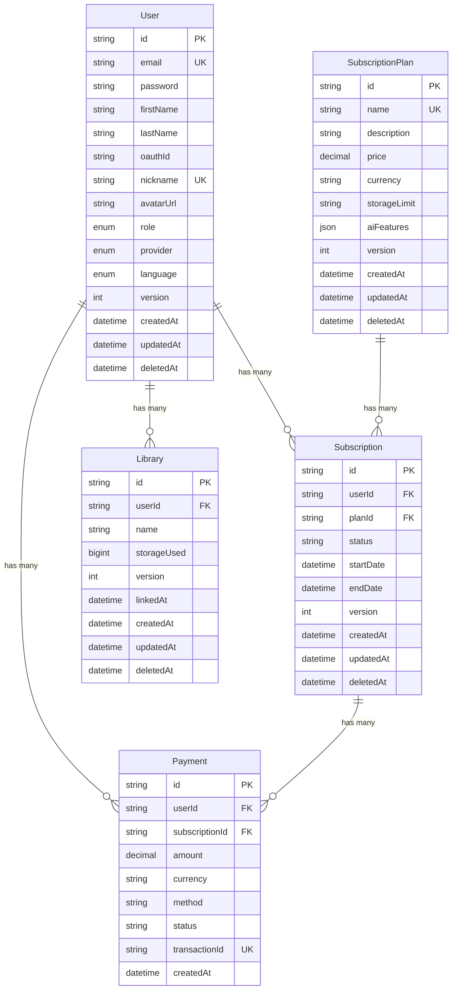

# Payment System ERD

## 개요
NewLearn Note의 결제 및 구독 시스템 데이터베이스 스키마

---

## ERD Diagram



---

## 테이블 상세 설명

### 1. User (사용자)
**테이블명**: `user`

**설명**: 서비스 사용자 정보

**주요 필드**:
| 필드명 | 타입 | 제약 | 설명 |
|--------|------|------|------|
| id | VARCHAR(255) | PK | ULID 기본키 |
| email | VARCHAR(255) | UNIQUE | 이메일 (로그인) |
| password | VARCHAR(255) | NULLABLE | 비밀번호 (OAuth는 NULL) |
| firstName | VARCHAR(255) | NOT NULL | 이름 |
| lastName | VARCHAR(255) | NOT NULL | 성 |
| oauthId | VARCHAR(255) | NULLABLE | OAuth ID |
| nickname | VARCHAR(100) | UNIQUE | 닉네임 |
| avatarUrl | VARCHAR(500) | NOT NULL | 프로필 이미지 URL |
| role | ENUM | DEFAULT 'user' | 권한 (user, admin, super_admin) |
| provider | ENUM | DEFAULT 'local' | 인증 제공자 (local, google) |
| language | ENUM | DEFAULT 'en' | 언어 설정 (ko, en) |

**인덱스**:
- UNIQUE: email
- UNIQUE: nickname
- UNIQUE: (oauthId, provider)

**관계**:
- Subscription (1:N) - 구독 내역
- Payment (1:N) - 결제 내역
- Library (1:N) - 라이브러리

---

### 2. SubscriptionPlan (구독 플랜)
**테이블명**: `subscription_plan`

**설명**: 서비스 요금제 정보 (FREE, BASIC, PREMIUM)

**주요 필드**:
| 필드명 | 타입 | 제약 | 설명 |
|--------|------|------|------|
| id | VARCHAR(255) | PK | ULID 기본키 |
| name | VARCHAR(255) | UNIQUE | 플랜 이름 (FREE, BASIC, PREMIUM) |
| description | TEXT | NULLABLE | 플랜 설명 |
| price | DECIMAL(10,2) | NOT NULL | 월 구독료 (USD) |
| currency | VARCHAR(5) | NOT NULL | 통화 (USD, KRW 등) |
| storageLimit | VARCHAR(20) | NOT NULL | 저장 용량 제한 ("500MB", "5GB", "10GB") |
| aiFeatures | JSON | NOT NULL | AI 기능 설정 {"chat": boolean, "documentAnalysis": boolean} |

**인덱스**:
- UNIQUE: name

**현재 데이터**:
| name | price | storageLimit | aiFeatures |
|------|-------|--------------|------------|
| FREE | 0.00 | 500MB | {"chat": false, "documentAnalysis": false} |
| BASIC | 5.00 | 5GB | {"chat": false, "documentAnalysis": false} |
| PREMIUM | 10.00 | 10GB | {"chat": true, "documentAnalysis": true} |

**관계**:
- Subscription (1:N) - 구독

---

### 3. Subscription (구독)
**테이블명**: `subscription`

**설명**: 사용자의 플랜 구독 정보

**주요 필드**:
| 필드명 | 타입 | 제약 | 설명 |
|--------|------|------|------|
| id | VARCHAR(255) | PK | ULID 기본키 |
| userId | VARCHAR(255) | FK | User.id |
| planId | VARCHAR(255) | FK | SubscriptionPlan.id |
| status | VARCHAR(50) | NOT NULL | 구독 상태 (active, canceled, past_due) |
| startDate | TIMESTAMP | NOT NULL | 구독 시작일 |
| endDate | TIMESTAMP | NULLABLE | 구독 종료일 (FREE는 NULL) |

**인덱스**:
- INDEX: userId
- INDEX: planId

**상태 값**:
- `active`: 활성 구독
- `canceled`: 취소된 구독
- `past_due`: 결제 실패

**비즈니스 로직**:
- 사용자는 동시에 여러 구독을 가질 수 있음 (이력 관리)
- 현재 활성 구독: `status = 'active' AND deletedAt IS NULL`
- FREE 플랜: endDate = NULL (무기한)
- BASIC/PREMIUM: endDate = startDate + 1개월

**관계**:
- User (N:1) - 소유자
- SubscriptionPlan (N:1) - 플랜
- Payment (1:N) - 결제 내역

---

### 4. Payment (결제)
**테이블명**: `payment`

**설명**: 결제 트랜잭션 내역

**주요 필드**:
| 필드명 | 타입 | 제약 | 설명 |
|--------|------|------|------|
| id | VARCHAR(255) | PK | ULID 기본키 |
| userId | VARCHAR(255) | FK | User.id |
| subscriptionId | VARCHAR(255) | FK | Subscription.id |
| amount | DECIMAL(10,2) | NOT NULL | 결제 금액 |
| currency | VARCHAR(5) | NOT NULL | 통화 (USD, KRW 등) |
| method | VARCHAR(50) | NOT NULL | 결제 수단 (credit_card, paypal, toss, naver) |
| status | VARCHAR(50) | NOT NULL | 결제 상태 (completed, pending, failed, refunded) |
| transactionId | VARCHAR(100) | UNIQUE | 외부 결제 시스템 거래 ID |

**인덱스**:
- INDEX: userId
- UNIQUE: transactionId

**결제 수단 (method)**:
- `credit_card`: 신용카드
- `paypal`: PayPal
- `toss`: 토스페이먼츠
- `naver`: 네이버페이

**결제 상태 (status)**:
- `completed`: 결제 완료
- `pending`: 결제 대기 중
- `failed`: 결제 실패
- `refunded`: 환불 완료

**관계**:
- User (N:1) - 결제자
- Subscription (N:1) - 구독

---

### 5. Library (라이브러리)
**테이블명**: `library`

**설명**: 사용자의 문서 저장소 (용량 추적용)

**주요 필드**:
| 필드명 | 타입 | 제약 | 설명 |
|--------|------|------|------|
| id | VARCHAR(255) | PK | ULID 기본키 |
| userId | VARCHAR(255) | FK | User.id |
| name | VARCHAR(255) | NOT NULL | 라이브러리 이름 |
| storageUsed | BIGINT | DEFAULT 0 | 사용 중인 저장 공간 (바이트) |

**비즈니스 로직**:
- FREE 플랜: 최대 1개 Library 생성 가능
- BASIC/PREMIUM: 무제한 생성 가능
- storageUsed는 파일 업로드/삭제 시 자동 증감
- 총 사용량 = SUM(Library.storageUsed WHERE userId = ? AND deletedAt IS NULL)

**용량 제한**:
| 플랜 | Library 개수 제한 | 총 저장 용량 제한 |
|------|------------------|------------------|
| FREE | 1개 | 500MB (524,288,000 bytes) |
| BASIC | 무제한 | 5GB (5,368,709,120 bytes) |
| PREMIUM | 무제한 | 10GB (10,737,418,240 bytes) |

**관계**:
- User (N:1) - 소유자
- Note (1:N) - 노트

---

## 비즈니스 플로우

### 1. 신규 가입 플로우
```
1. User 생성 (Google OAuth)
2. Subscription 자동 생성 (FREE 플랜)
   - status: 'active'
   - startDate: NOW()
   - endDate: NULL
```

### 2. 플랜 업그레이드 플로우
```
1. 결제 진행 (Payment 생성)
   - status: 'pending'
2. 결제 성공 시:
   a. Payment.status = 'completed'
   b. 기존 Subscription.status = 'canceled', endDate = NOW()
   c. 새 Subscription 생성 (BASIC/PREMIUM)
      - status: 'active'
      - startDate: NOW()
      - endDate: NOW() + 1개월
```

### 3. 플랜 다운그레이드 플로우
```
1. 용량 검증:
   - SUM(Library.storageUsed) <= 새 플랜 제한?
   - (FREE의 경우) COUNT(Library) <= 1?
2. 검증 통과 시:
   a. 기존 Subscription.status = 'canceled', endDate = NOW()
   b. 새 Subscription 생성
```

### 4. 구독 취소 플로우
```
1. Subscription.status = 'canceled', endDate = NOW()
2. FREE 플랜 Subscription 자동 생성
```

### 5. 용량 제한 확인 플로우
```
파일 업로드 전:
1. 현재 플랜 조회 (getCurrentPlan)
2. 총 사용량 조회 (getStorageUsage)
   - SUM(Library.storageUsed WHERE userId = ? AND deletedAt IS NULL)
3. 제한 조회 (getStorageLimit)
   - SubscriptionPlan.storageLimit → 바이트 변환
4. 검증: currentUsage + uploadSize <= limit
5. 통과 시:
   - 파일 업로드
   - Library.storageUsed += uploadSize
```

---

## 쿼리 예시

### 현재 활성 구독 조회
```sql
SELECT s.*, sp.*
FROM subscription s
JOIN subscription_plan sp ON s.planId = sp.id
WHERE s.userId = ?
  AND s.status = 'active'
  AND s.deletedAt IS NULL
ORDER BY s.createdAt DESC
LIMIT 1;
```

### 총 저장 용량 사용량 조회
```sql
SELECT COALESCE(SUM(storageUsed), 0) as totalUsed
FROM library
WHERE userId = ?
  AND deletedAt IS NULL;
```

### Library 개수 조회
```sql
SELECT COUNT(*) as libraryCount
FROM library
WHERE userId = ?
  AND deletedAt IS NULL;
```

### 사용자의 결제 내역 조회
```sql
SELECT p.*, s.*, sp.name as planName
FROM payment p
JOIN subscription s ON p.subscriptionId = s.id
JOIN subscription_plan sp ON s.planId = sp.id
WHERE p.userId = ?
ORDER BY p.createdAt DESC;
```

---

## 인덱스 전략

### 성능 최적화를 위한 인덱스
1. **Subscription**: (userId, status, deletedAt) - 현재 구독 조회
2. **Library**: (userId, deletedAt) - 용량 계산
3. **Payment**: (userId, createdAt) - 결제 내역 조회

---

## 데이터 무결성 규칙

### 제약 조건
1. User.email은 UNIQUE (중복 가입 방지)
2. User.nickname은 UNIQUE (닉네임 중복 방지)
3. SubscriptionPlan.name은 UNIQUE (플랜명 중복 방지)
4. Payment.transactionId는 UNIQUE (중복 결제 방지)

### 외래 키 제약
1. Subscription.userId → User.id (CASCADE)
2. Subscription.planId → SubscriptionPlan.id (RESTRICT)
3. Payment.userId → User.id (CASCADE)
4. Payment.subscriptionId → Subscription.id (RESTRICT)
5. Library.userId → User.id (CASCADE)

### 비즈니스 규칙
1. FREE 플랜 사용자는 최대 1개의 Library만 생성 가능
2. 구독 다운그레이드 시 현재 사용량이 새 플랜 제한 이하여야 함
3. 활성 구독은 사용자당 최대 1개 (status='active' AND deletedAt IS NULL)
4. Payment는 삭제 불가 (감사 추적용)

---

## 변경 이력

| 날짜 | 버전 | 변경 내용 |
|------|------|-----------|
| 2026-02-13 | 1.0.0 | 초기 ERD 작성 (결제 시스템) |
| 2026-02-13 | 1.1.0 | Library.storageUsed 필드 추가 (용량 추적) |
